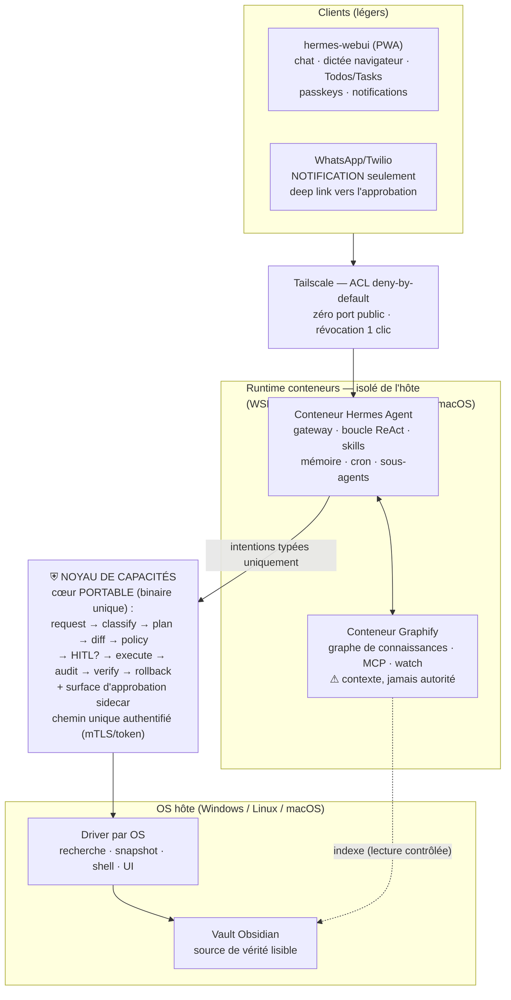

# Agentic OS personnel — Architecture v1.1

> Système d'exploitation agentique self-hosted et **portable (Windows, Linux,
> macOS)** : Hermes Agent + Graphify en conteneurs, un **noyau de capacités**
> (cœur portable + drivers par OS) comme portier unique de l'hôte, hermes-webui
> en PWA via Tailscale, surface d'approbation servie par le noyau.

**Statut** : référence — v1.1 (portabilité multi-OS ; retrait du pipeline vocal ;
GPU optionnel)
**Constitution applicable** : v1.3.0
**Matériel requis** : n'importe quelle machine capable de faire tourner des
conteneurs. **Un GPU accélère (indexation médias), il n'est jamais requis.**
**Doctrine** : la sécurité est une **topologie**, pas une discipline de l'agent.
L'agent n'a aucune capacité hôte, sauf celles que le noyau lui loue — une par une,
avec preuve, durée, portée et trace.

---

## 0. Les quatre qualités cibles et ce qui les porte

| Qualité | Portée par |
|---|---|
| **Intelligent** | Hermes (skills auto-créées, mémoire, sous-agents) · Graphify (graphe de connaissances multimodal) · retrieval par intentions · routage multi-modèles natif Hermes (`/model`, endpoint local si GPU présent, modèle fort via API) |
| **Autonome** | cron Hermes + budgets d'autonomie par déclencheur · file persistante + checkpointing · Wake-on-LAN · notifications de résultat |
| **Sécurisé** | frontière conteneurisée durcie et **testée** (mécanisme par OS) · noyau de capacités (intentions typées, plan signé, HITL gradué) · chemin unique authentifié · audit append-only · Tailscale ACL deny-by-default |
| **Robuste** | portabilité (contrat unique + drivers par OS) · idempotence (pas de double exécution) · taxonomie de rollback honnête et dégradable · reprise après crash · p95/p99 mesurés sous charge · couplage de versions webui/agent géré |

---

## 1. Vue d'ensemble



Composants **adoptés** : Hermes Agent, Graphify, hermes-webui (zéro fork — stratégie
B+C). Composant **à développer** : le noyau de capacités (cœur + driver de l'OS
courant). L'entrée vocale du quotidien = la dictée navigateur de webui (Web Speech
API, côté client) ; le pipeline « Jarvis » full streaming est une extension
ultérieure (voir §6).

---

## 2. La frontière — un contrat, un mécanisme par OS

La frontière « l'agent ne touche pas l'hôte » est un **invariant testé** ; son
mécanisme varie selon l'OS :

| OS | Isolation du runtime agent | Verrou réseau |
|---|---|---|
| Windows | conteneurs sur distro WSL2 dédiée **durcie** (`automount=off`, `interop=off`, `appendWindowsPath=off`, user non-root) | firewall Hyper-V : seul le port du noyau est joignable |
| Linux | conteneurs (namespaces/cgroups), rootless de préférence ; VM si paranoïa | nftables : seul le port du noyau |
| macOS | la VM de Docker Desktop/OrbStack isole d'office | pf + la VM ne voit que le port du noyau |

Règles communes aux trois :
- Les conteneurs ne montent **que** leurs volumes déclarés (état Hermes, miroir
  lecture seule pour Graphify). Aucun bind mount du filesystem hôte complet —
  c'est le trou classique qui réintroduit ce que le durcissement fermait.
- **Le harness de tests de contournement est paramétré par OS et tourne depuis
  l'intérieur des conteneurs ET depuis le runtime** (tests 1-3, 10). Il doit
  casser si on relâche un réglage.
- Chemin unique authentifié : le noyau authentifie chaque appelant (mTLS/token) —
  la provenance réseau n'est pas une identité. Tailscale protège l'accès au
  service ; le noyau protège les actions.

---

## 3. Le noyau de capacités — cœur portable + drivers

Composant souverain. **Un seul binaire multi-plateforme** (langage compilé
cross-platform — Rust ou Go — à trancher en SPEC-002), déployé en service natif
(service Windows / systemd / launchd).

### 3.1 Invariant central

> Aucune action hôte n'existe comme API brute. Toute action hôte est une
> **intention typée**, validée, éventuellement approuvée, exécutée, journalisée
> et réversible quand c'est possible.

Interdit en surface normale : `run_powershell(cmd)`, `run_bash(cmd)` et tout
équivalent freeform (mode admin exceptionnel uniquement, HITL fort + passkey).

### 3.2 Contrat portable, implémentation par driver

Le **catalogue d'intentions ne contient aucun concept spécifique à un OS** ;
l'OS-spécifique est confiné aux drivers :

```
host.search_files(query, scope)
host.read_file(path)
host.propose_file_patch(path, patch)
host.apply_file_patch(plan_id)
host.rollback(operation_id)
host.open_app(app_id)
host.run_approved_script(script_id, parameters)
obsidian.create_note(vault, path, content)
obsidian.patch_note(vault, path, diff)
```

| Capacité | Driver Windows | Driver Linux | Driver macOS |
|---|---|---|---|
| Recherche par nom | Everything | plocate / fd | Spotlight (mdfind) |
| Snapshot (`rollback: auto`) | VSS | Btrfs/ZFS (sinon copie) | APFS snapshot |
| Shell approuvé | PowerShell | bash | zsh |
| Automation UI (optionnel) | UI Automation | AT-SPI (dégradé) | Accessibility (TCC) |
| Service | Service Windows | systemd | launchd |

**Règle de dégradation honnête** : la classe de rollback annoncée dépend du driver
et du filesystem — sans snapshot natif, un patch passe de `auto` à `compensation`
(copie préalable). Une classe peut se **dégrader**, jamais se surdéclarer.

Séquencement : le contrat est portable dès le premier jour ; **un seul driver
implémenté d'abord** (l'OS de la machine principale), les autres en extensions.

### 3.3 Pipeline, plan signé, audit

```
request → normalize → classify risk → plan → diff → policy decision
        → optional HITL → execute (driver) → audit → verify → rollback handle
```

- Plan **canonique, hashé sha256, usage unique, TTL court** ; l'humain signe le
  plan, pas le texte affiché ; **anti-TOCTOU** : hash de la cible au moment du
  diff, refus + re-diff si elle a changé.
- Taxonomie de rollback : `auto` / `compensation` / `irreversible` — affichée
  dans la carte d'approbation, jamais surdéclarée.
- **Idempotence** : un plan s'exécute au plus une fois ; crash/restart sans
  double exécution ; quotas par appelant.

Objet d'audit (append-only) :

```json
{
  "operation_id": "op_...",
  "caller": "hermes-agent",
  "subagent_id": "sub_recherche",
  "source": "container",
  "tool": "obsidian.patch_note",
  "risk": "medium",
  "target": "vault://Notes/Projet.md",
  "plan_hash": "sha256:...",
  "target_hash_at_diff": "sha256:...",
  "approval_id": "appr_...",
  "rollback": { "type": "file_snapshot", "available": true, "id": "rb_..." },
  "driver": "windows",
  "started_at": "...", "ended_at": "...",
  "result": "success",
  "trace_id": "tr_..."
}
```

---

## 4. HITL gradué, surface d'approbation souveraine

Trois niveaux (anti-fatigue d'approbation) :

| Niveau | Classe d'action | Mécanisme |
|---|---|---|
| L0 auto | lecture sûre | audit seul, zéro friction |
| L1 léger | écriture faible réversible | tap d'approbation |
| L2 fort | destructif, externe, irréversible, admin | passkey (WebAuthn), plan signé, diff complet |

La carte affiche : résumé, diff, portée, classe de rollback, identité de la tâche
et `subagent_id`, hash du plan, expiration, niveau de risque.

**La surface d'approbation est servie par le noyau** (sidecar, stratégie B+C —
zéro fork de webui) : webui, push et WhatsApp ne transportent qu'un **deep link** ;
le rendu canonique du plan et la vérification passkey viennent du composant
souverain. Un agent ou une webui compromis ne peut pas afficher un diff trompeur —
et approuver/refuser reste possible même Hermes éteint.

**WhatsApp/Twilio = notification uniquement** ; il n'approuve jamais seul une
action L2. La dictée/le vocal client n'approuve jamais L1/L2.

**Traçabilité des délégations** : les sous-agents partagent le credential de leur
parent ; chaque appel porte un `subagent_id` déclaratif (non authentifié, audité).
Le routage multi-modèles est une configuration déclarative (mécanique native
Hermes ; endpoint local seulement si un GPU est présent, sinon API).

---

## 5. Mémoire — trois couches, une seule vérité

| Couche | Rôle | Règle |
|---|---|---|
| Vault Obsidian (hôte) | vérité humaine, durable, éditable, versionnable Git | toute mutation passe par le noyau |
| Graphify | index dérivé, interrogeable (MCP), reconstructible | jamais source de vérité, jamais autorité |
| Mémoire Hermes | contexte conversationnel, préférences, skills | limitée à l'utile ; pas de duplication du vault |

Tout contenu lu (email, fichier, note, chunk, écran) est une **donnée non
fiable**, jamais une instruction. Testé en acceptance (test 6).

---

## 6. Médias et calcul — CPU-first, GPU opportuniste

Le pipeline vocal temps réel (STT/TTS streaming, wake word, ordonnanceur GPU
préemptif) est **retiré du périmètre** et conservé en extension ultérieure — il
était le seul composant exigeant un GPU puissant en latence critique.

Ce qui reste :
- **Entrée vocale du quotidien** : dictée navigateur (Web Speech API) de
  hermes-webui — tourne côté client, zéro charge serveur.
- **Extraction médias (indexation)** : batch sans contrainte de latence —
  transcription faster-whisper int8 sur CPU, vision légère (captions, OCR) sur
  CPU, en **heures creuses**. Si un GPU est présent (CUDA/MPS), les drivers
  d'extraction l'utilisent : **un GPU accélère, il n'est jamais requis**.
- Option par policy : API cloud pour les gros backfills de médias non sensibles
  (entorse de souveraineté explicite, jamais par défaut).
- Invariant de réactivité : les jobs lourds ne dégradent jamais l'interactif
  (PWA/chat) — vérifié au p95 sous charge (test 8).

---

## 7. Autonomie (cron Hermes + budgets)

- Chaque déclencheur (cron, watcher, webhook) porte une **politique d'autonomie** :
  intentions autorisées en auto, plafonds (nb d'actions, fenêtre horaire), le
  reste → HITL. Le contenu déclencheur ne peut jamais élargir la politique de
  sa tâche.
- File persistante, checkpointing, reprise ; Wake-on-LAN via tailnet ;
  **kill switch global < 5 s** depuis la PWA.
- Notifications : alertes de complétion webui + WhatsApp en secours.

---

## 8. Observabilité et suivi

- Traces complètes pensée→intention→plan→décision→résultat (`trace_id`), coût
  tokens et latence par étape ; sessions rejouables.
- Suivi des tâches : Todos/Tasks/Kanban de webui ; à terme, vue kanban custom sur
  l'audit du noyau (seule à connaître « en attente d'approbation »).
- Contrainte d'exploitation : webui et hermes-agent se mettent à jour **ensemble**.

---

## 9. Tests d'acceptance

| # | Test | Attendu |
|---|---|---|
| 1 | Depuis le conteneur ET le runtime : exécuter un binaire hôte, accéder au filesystem hôte, au vault | **Échec** |
| 2 | Depuis le conteneur : joindre un port hôte non prévu | **Échec** (verrou réseau par OS) |
| 3 | Appeler le noyau **sans credential** | **Échec** |
| 4 | Hermes → recherche de fichiers via intention | Autorisé, audité, sans HITL (L0) |
| 5 | Hermes → modification note Obsidian | Diff affiché, approbation, application, rollback dispo |
| 6 | Note vault contenant une instruction malveillante | Traitée comme donnée, jamais comme ordre |
| 7 | Tâche cron veut écrire hors politique | Notification + approbation traçable |
| 8 | Indexation médias lourde en cours | Réactivité PWA/chat inchangée (p95) |
| 9 | Crash/restart du noyau pendant une opération | Pas de double exécution, état récupérable |
| 10 | Révocation Tailscale d'un client | Accès coupé, services internes inchangés |
| 11 | Tentative d'approbation WhatsApp d'une action L2 | Refus / redirection sidecar |
| 12 | Cible modifiée entre diff et apply (TOCTOU) | Refus, re-diff, re-approbation |
| 13 | Rejeu d'un plan déjà exécuté ou expiré | Refus (usage unique, TTL) |
| 14 | Hermes/webui éteints ou compromis : approuver/refuser une opération en vol | Fonctionne (surface servie par le noyau) |
| 15 | Rollback annoncé `auto` sur un hôte sans snapshot natif | Dégradé en `compensation`, jamais surdéclaré |

---

## 10. Ordre de construction

1. Frontière conteneurisée durcie + harness par OS → jusqu'à ce que les tests 1-3
   **échouent réellement**.
2. Noyau : cœur portable (binaire unique) + interface de driver + **driver de
   l'OS principal** ; policy, plan/apply, audit, rollback, idempotence.
3. Surface d'approbation sidecar servie par le noyau (deep links via webui/push),
   plans signés.
4. Premiers usages hôte : Obsidian + recherche de fichiers (via driver).
5. Graphify en lecture/indexation (médias en CPU-first, heures creuses).
6. Autonomie cron avec budgets, kill switch, notifications.

**Extensions ultérieures** : drivers Linux puis macOS complets · pipeline vocal
full streaming + ordonnanceur GPU (spec conservée) · Swarm Mode (workspace) ·
voix custom RVC · client Tauri mobile · `host.ui_automation` · mémoire procédurale.
