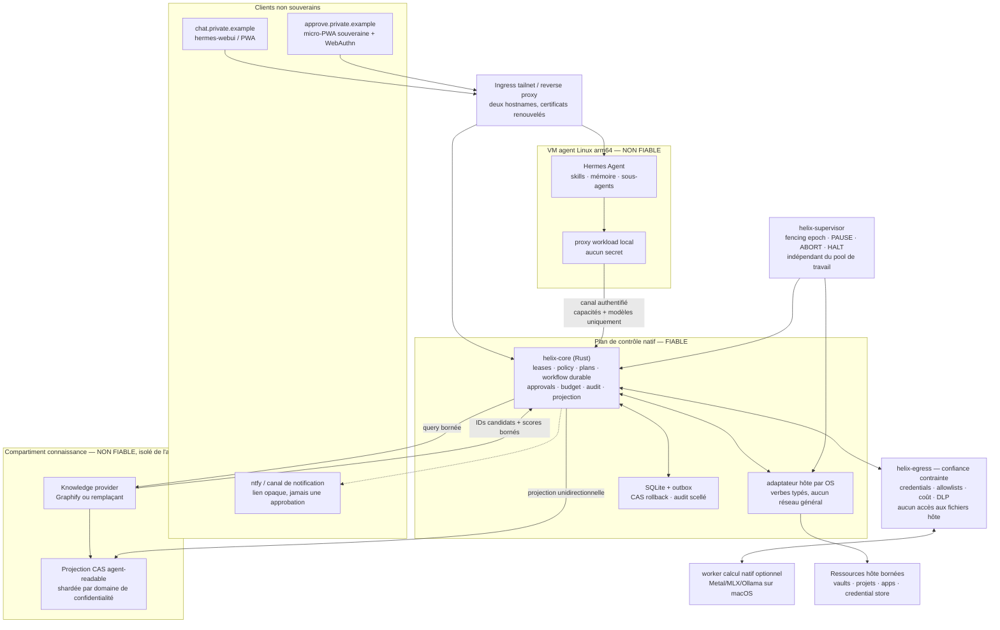
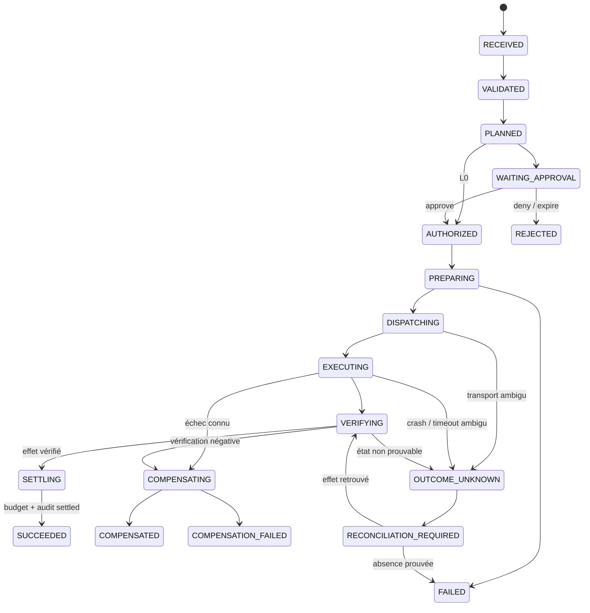

# HelixOS — Architecture cible v2.0.0

> Plan de contrôle agentique personnel, self-hosted et portable. Le Mac mini M4
> est la plateforme de référence ; Linux est le second port qui prouve la
> portabilité ; Windows reste une cible de production. L'agent, ses outils, les
> modèles et tout contenu qu'ils lisent sont présumés compromis.

**Statut** : architecture cible, pas état de l'implémentation
**Date** : 2026-07-10
**Constitution applicable** : v2.0.0
**Plateforme de référence** : macOS sur Apple Silicon, `arm64` natif
**Cibles de compatibilité** : macOS Apple Silicon, Linux `x86_64/arm64`,
Windows 11 `x86_64` ; les autres combinaisons sont best-effort tant
qu'elles ne passent pas le même harness.

Le manifest de release fixe les versions exactes. Référence initiale : Mac mini
M4/macOS 26.x (26.5+ seulement pour certaines fonctions de retour secteur) ;
Linux Tier 1 sur une distribution systemd/cgroup v2/KVM figée ; Windows 11
Pro/Enterprise x64 avec Hyper-V/SLAT. Windows Home/WSL et architectures non
prouvées restent Tier 2 ou smoke.

HelixOS n'est pas un noyau de système d'exploitation au sens matériel. C'est un
**plan de contrôle de capacités** : il reçoit des intentions typées, applique une
politique, demande une approbation si nécessaire, orchestre l'effet hôte, vérifie
le résultat et conserve une preuve durable.

Le dépôt actuel contient un prototype MVP-0 orienté Windows/WSL2. Cette version
décrit la cible à atteindre ; elle ne transforme pas ce prototype en produit
portable par déclaration. La portabilité ne sera revendiquée qu'après passage du
harness inchangé sur macOS et un second OS.

---

## 0. Diagnostic et décisions majeures

L'architecture précédente avait de bons invariants — agent présumé compromis,
intentions typées, bail de portée, HITL souverain et audit séparé — mais plusieurs
choix Windows avaient contaminé le contrat portable.

| Problème constaté | Décision v2 |
|---|---|
| Windows/WSL2/VSS au centre alors que la machine cible est un Mac mini M4 | macOS/arm64 devient le profil de référence ; Linux est porté tôt, puis Windows |
| Conteneur « lecture seule » du vault pour Graphify | aucun partage hôte ; projection agent-readable, compartimentée et médiée par le cœur |
| « un seul port » alors que modèles, DNS, notifications et mises à jour ont besoin du réseau | plans réseau explicites : ingress, capacités, egress contrôlé et maintenance |
| Clés fournisseur présentes dans le runtime agent | gateway modèle/egress de confiance ; l'agent ne reçoit jamais les secrets |
| mTLS identifie un conteneur mais pas une tâche | identité de workload courte + `TaskLease` signé et borné par tâche |
| « at-most-once » présenté comme garantie universelle | machine d'état durable, clés d'idempotence, vérification et état `OUTCOME_UNKNOWN` |
| `ReplaceFile` présenté comme portable et compensation « garantie » | protocole de patch par OS ; récupération annoncée seulement après préparation et vérification |
| origine d'approbation distinguée seulement par le port | hostname dédié, cookies host-only, aucun CORS et WebAuthn lié au digest complet |
| traces de « pensée » | événements structurés, résumés de décision et provenance ; jamais de chaîne de pensée privée |
| relais Linux obligatoire | relais optionnel pour réveil/healthcheck hors bande ; le Mac mini peut fonctionner en profil toujours-allumé |

### Qualités cibles

1. **Sûr par construction** : un agent totalement compromis ne peut ni élargir
   son bail, ni lire un secret brut, ni établir un egress non médié, ni produire
   un effet hôte hors bail/policy/approval valides.
2. **Robuste** : chaque effet a une machine d'état durable, une sémantique de
   reprise explicite et un résultat vérifié ; l'incertitude n'est jamais masquée.
3. **Portable** : les contrats et le harness sont communs ; les primitives OS
   restent dans des adaptateurs et sont découvertes au runtime.
4. **Performant** : contrôle interactif prioritaire, files bornées, backpressure,
   limites CPU/mémoire/I/O et calcul Metal natif sur le M4.
5. **Opérable** : sauvegarde restaurée, mises à jour signées et réversibles,
   télémétrie sobre, kill path indépendant et modes dégradés exercés.

---

## 1. Modèle de menace et limites

### 1.1 Présumé hostile

- Hermes, ses sous-agents, ses skills auto-générées et ses outils ;
- Graphify ou tout autre moteur de connaissance ;
- hermes-webui et tout rendu provenant de la pile agent ;
- modèles locaux ou cloud, connecteurs MCP et plugins tiers ;
- emails, pages web, fichiers, notes, résultats de recherche et sorties de modèle ;
- tout processus de la VM agent après compromission d'un seul workload.

### 1.2 De confiance minimale

- l'OS hôte et le matériel ;
- `helix-core`, son moteur de policy et son coordinateur durable ;
- l'adaptateur hôte de l'OS courant ;
- `helix-supervisor`, petit composant indépendant de pause/arrêt/fencing ;
- `helix-egress`, de confiance pour credentials/coûts mais sandboxé sans
  accès aux ressources hôte ;
- la surface d'approbation rendue par le cœur et l'authenticator WebAuthn humain ;
- les clés détenues par le store natif de l'OS.

Le cœur et les adaptateurs sont des composants sensibles : ils sont petits,
versionnés, signés, testés et n'embarquent pas de modèle. Un compromis
administrateur/root de l'hôte, du firmware ou de la chaîne de build souveraine
est hors du périmètre de prévention. Le journal signé et sa copie hors hôte
visent néanmoins à rendre certaines altérations détectables.

### 1.3 Invariants non négociables

- **Aucun montage du filesystem hôte dans la VM agent**, même en lecture seule.
- **Aucun accès réseau direct des workloads** vers Internet, le LAN, le tailnet,
  les métadonnées cloud ou les sockets du runtime.
- **Aucun secret brut dans le runtime agent**, ses variables, volumes, prompts ou
  logs.
- Toute donnée copiée dans une VM non fiable est considérée **divulguée à cette
  VM entière**. Une projection est une déclassification explicite, jamais un simple
  cache technique.
- **Aucune API shell libre** accessible à un credential d'agent.
- **Aucune auto-autorisation** : seul le cœur émet ou élargit un bail.
- **Aucune mutation agentique durable hors du cœur**. Les modifications humaines
  ou faites par Obsidian restent autorisées et sont réconciliées comme vérité
  documentaire.
- Les binaires, policies, clés, audits, sauvegardes, UI d'approbation et le
  superviseur sont des cibles interdites à toutes les intentions normales.

---

## 2. Topologie cible



Le dessin montre des **responsabilités**, pas une obligation de microservices.
Pour rester réaliste en solo :

- policy, workflow, approval, audit et coordination de projection restent dans le
  même binaire `helix-core` ;
- `helix-egress` est séparé en Tier 1 : il parse le trafic fournisseur et
  détient des credentials, mais n'a ni accès aux fichiers hôte, ni policy, ni
  capacité d'exécution ;
- l'adaptateur devient un processus séparé seulement quand l'OS, le sandbox ou
  l'élévation le justifie ;
- le superviseur reste séparé parce qu'il doit fonctionner si le cœur est bloqué ;
- le provider de connaissance n'a aucun lien direct avec Hermes. Un profil qui le
  colocalise dans la VM agent déclare toute sa projection `agent-readable` et
  ne peut être Tier 1 pour des domaines de confidentialité distincts ;
- les workers Metal/UI/administrateur sont optionnels et n'élargissent jamais le
  contrat du cœur.

---

## 3. Plans réseau et frontière d'exécution

La sécurité ne dépend pas d'un nombre magique de ports. Elle dépend de
destinations, d'identités et de flux explicitement autorisés.

| Plan | Flux autorisé | Flux interdit |
|---|---|---|
| Interne compartiment | workload ↔ proxy local ou provider ↔ son CAS dédié | lien direct agent↔knowledge, accès au host ou à un réseau externe |
| Capacité | proxy workload → `helix-core`, authentifié | tout autre port/service hôte |
| Modèle/egress | cœur → `helix-egress` → destinations policy | DNS libre, IP littérale, LAN, tailnet, URL arbitraire, redirection non validée |
| Ingress | tailnet → hostnames chat/approval dédiés | port public Internet |
| Maintenance | updater/superviseur → registres et dépôts épinglés | accès depuis les workloads ; ouvert seulement pendant la maintenance |

### 3.1 Profil macOS de référence

Une VM Linux `arm64` dédiée, sans périphérique de partage de répertoire,
porte les workloads. Podman Machine rootless est utile au prototype à condition de
supprimer le montage implicite `$HOME:$HOME` et de vérifier la table réelle
des montages. Son NAT général n'est toutefois pas Tier 1 face à root dans le guest.
Docker Desktop et OrbStack restent également des profils Tier 2/développement
tant que le harness n'établit pas une frontière équivalente.

`apple/container` est un candidat intéressant sur macOS 26+ : OCI natif,
optimisé Apple Silicon et VM légère par conteneur. La version 1.1.0 existe au
2026-07-10, mais une version majeure stable ne prouve ni les flux HelixOS, ni
l'isolation réseau, ni la récupération. Tant que ces capacités n'ont pas passé le
harness, ce backend reste expérimental pour HelixOS.

En Tier 1, la VM n'a **pas de NIC généraliste** : canal vsock/HVSocket uniquement,
ou interface virtuelle filtrée par l'hôte/hyperviseur avec deny par défaut. Root
dans le guest ne doit pas pouvoir rétablir DNS, NAT, LAN ou Internet. Le firewall
guest reste une défense en profondeur, jamais le contrôle primaire.

Le host updater télécharge et vérifie les artefacts puis les importe dans le guest
par vsock, disque de staging borné ou archive OCI. Le guest ne tire jamais ses
propres images.

Transport VM→hôte :

1. `virtio-vsock` si le backend l'expose de façon stable ;
2. TCP sur une interface dédiée + mTLS sinon.

Le transport ne constitue jamais l'identité. Une clé présente dans une VM
compromise est présumée volée : l'identité authentifie donc le **compartiment/VM**,
pas des conteneurs entre lesquels root peut circuler. Une identité de service forte
exige un compartiment séparé. Le contrôle de portée reste le `TaskLease`.

`helix-vmhost` possède le cycle de vie : entitlement Virtualization,
guest kernel/init/rootfs signés, boot après login ou mode headless déclaré,
readiness/crash-loop, shutdown, import OCI, mise à jour/rollback guest et canal
vsock. Un runtime user-scoped n'est jamais supposé disponible avant login.

### 3.2 Durcissement workload

- images OCI `linux/arm64` natives sur M4, résolues par digest ;
- user non-root, root filesystem read-only si possible, `no-new-privileges`,
  capabilities Linux supprimées, seccomp/LSM selon backend ;
- limites CPU, mémoire, PIDs, I/O et taille des logs ;
- volumes nommés VM-local uniquement ;
- aucun `docker.sock`/`podman.sock`, `host network`, mode privilégié,
  PID/IPC host, device hôte ou SSH agent ;
- egress bloqué par l'hôte/hyperviseur ; les règles guest/workload ne sont qu'une
  seconde couche ;
- une compromission totale de la VM fait partie du test d'acceptance.

---

## 4. Identité, baux et contrats

### 4.1 Deux identités complémentaires

**WorkloadIdentity** authentifie un compartiment ou service réellement isolé.
C'est un certificat court, roté automatiquement et révocable par serial/epoch. La
clé peut être tenue par un proxy host-side/vsock ; si elle réside dans le guest,
son vol jusqu'à rotation fait partie du blast radius. Cette identité n'accorde
aucune portée documentaire.

**HumanRequestGrant** prouve l'origine d'une requête interactive. Un
`helix-edge` minimal ou la surface souveraine authentifie le principal humain,
lie le hash du message, le canal/session, le template de portée, l'expiration et un
JTI one-shot, puis signe l'objet. Tailscale seul ne constitue pas cette preuve.

**TaskLease** autorise une tâche précise. Le cœur l'émet depuis un
`HumanRequestGrant` vérifié ou un déclencheur enregistré. Un message de chat
nu ne vaut pas autorisation : Hermes peut proposer une tâche ou demander un bail,
jamais le signer ni l'élargir. Une nouvelle racine devient une demande sur la
surface souveraine.

Champs normatifs d'un `TaskLease` :

```text
lease_id, task_id, grant_source(human_principal|trigger_id), workload_id
allowed_intents[], resource_roots[]
read_bytes_limit, distinct_files_limit, action_limit
currency_code, max_cost_micro_units, price_table_id, egress_bytes_limit
trust_class, issued_at, expires_at, boot_id, instance_epoch, jti
policy_version, catalog_version, parent_lease_id?, key_id, algorithm, signature
```

Une délégation ne peut que réduire portée, durée, budget et catalogue. Un nouveau
modèle, sous-agent ou canal ne récupère jamais l'union des anciens baux.

L'expiration combine UTC signée et deadline monotone liée au `boot_id`.
Après reboot, aucune lease/approval non terminale n'est reconvertie entre domaines
de ticks : elle expire ou est réémise. Un recul wall-clock suspect déclenche PAUSE
et revalidation ; sleep/resume est testé avec une horloge suspend-aware par OS.

### 4.2 Contrats versionnés

Les objets suivants sont des artefacts de premier ordre avec schéma, fixtures et
tests de compatibilité N/N-1 :

- `TaskLease` ;
- `HumanRequestGrant` et `PolicySnapshot` ;
- `IntentRequest` ;
- `PlanEnvelope` ;
- `ApprovalDecision` ;
- `ExecutionGrant` et `ExecutionReceipt` ;
- `BudgetReservation`, `SupervisorEpoch` et
  `ReconciliationDecision` ;
- `CapabilityReport` ;
- `IndexManifest` ;
- `AuditEvent`.

Toute intention ou version inconnue est **refusée**. « Policy inconnue =
approbation » est interdit : l'approbation humaine ne répare pas un contrat que le
cœur ne sait pas interpréter.

Chaque objet signé porte `schema_version`, `algorithm`, `key_id` et
domaine de signature. La rotation conserve les clés publiques nécessaires à la
vérification historique selon la rétention.

### 4.3 Ressources, jamais chemins bruts

L'agent manipule un identifiant tel que :

```text
helixfs://vault-main/Projects/Helix/Decision.md
```

Le registre fiable mappe `vault-main` vers une racine native approuvée.
L'adaptateur résout des composants relatifs depuis un handle de racine déjà ouvert.
Il :

- définit un encodage URI unique : percent-decoding une seule fois, puis
  normalisation ; séparateurs encodés, double encodage et Unicode ambigu sont
  refusés avant résolution ;
- refuse `..`, séparateurs injectés, NUL, chemins absolus et URI ambigus ;
- refuse par défaut symlinks, hardlinks multiples, junctions, reparse points,
  streams NTFS alternatifs et changements de volume ;
- normalise l'API en Unicode NFC, puis détecte les collisions selon la réalité du
  filesystem (casse/normalisation) ;
- ouvre sans suivre, relève l'identité stable du fichier/volume et hache via le
  handle ouvert ;
- revalide identité, taille et pré-hash immédiatement avant l'effet ;
- post-filtre chaque résultat Spotlight/Everything/plocate : un index n'est jamais
  un mécanisme d'autorisation.

Les volumes réseau, iCloud/OneDrive, placeholders, supports amovibles et
filesystems sans sémantique suffisante sont des classes de capacité distinctes,
désactivées par défaut.

---

## 5. Plan canonique et autorisation humaine

### 5.1 PlanEnvelope

Un plan est sérialisé en JSON canonique RFC 8785, sans flottants, puis haché
SHA-256 et signé Ed25519 par le cœur. Il contient au minimum :

- versions de schéma, catalogue et policy ;
- identité de tâche/workload, digest du bail et du `HumanRequestGrant` ou
  trigger ;
- intention normalisée et cibles `helixfs://` ;
- préconditions : file ID/volume ID, pré-hash, versions externes ;
- digest/heure du `CapabilityReport` et prédicats critiques à re-prober ;
- diff ou effets prévus complets ;
- profil d'atomicité et récupération **observé** ;
- prédicat de vérification ;
- `BudgetReservation` : devise, maximum, price-table ID et reservation ID ;
- expiration UTC, boot ID, nonce, `operation_id`, instance/fencing epoch,
  key ID et algorithme.

Le digest protège les octets canoniques ; l'UI rend ces mêmes données depuis le
store du cœur. Elle ne fait jamais confiance à un résumé produit par l'agent.

Sur macOS, la clé Ed25519 portable est protégée par Keychain mais n'est pas
présentée comme Secure-Enclave-backed. Une clé matérielle P-256 optionnelle peut
signer des checkpoints si l'objet déclare algorithme/key ID ; elle est device-bound
et suit un plan de récupération distinct.

### 5.2 Niveaux

| Niveau | Exemple | Autorisation |
|---|---|---|
| L0 | lecture bornée non sensible, recherche dans un bail | policy + audit |
| L1 | écriture locale récupérable, faible portée | session humaine authentifiée + confirmation |
| L2 | nouvelle destination/provider, effet externe visible, donnée sensible, administrateur, dépense hors enveloppe ou récupération absente | WebAuthn avec user verification |
| Refus | secret brut, intention inconnue, cible souveraine, portée non louée | aucune dérogation agentique |

L'inférence ou notification routinière dans une destination, classe de données et
enveloppe de coût pré-autorisées peut rester L0/L1 selon policy ; sinon l'autonomie
payante serait impossible.

Toute tâche agent démarre **non fiable et sticky**, car mémoire, skills et données
VM-locales peuvent déjà l'avoir influencée. Les lectures hôte, requêtes knowledge
et egress ajoutent une provenance observée ; elles ne sont pas l'unique source de
taint. Une règle déterministe, versionnée et de confiance peut déclassifier un
artefact ; un modèle ou champ fourni par l'agent ne le peut pas. Toute
classification agent-supplied est traitée au niveau le plus restrictif.

### 5.3 Surface souveraine

- hostname stable dédié, par exemple `approve.<domaine-privé>`, distinct de
  `chat.<domaine-privé>` ; un port différent ne suffit pas car les cookies ne
  sont pas isolés par port ;
- RP ID égal au hostname d'approbation exact, jamais au parent partagé ;
- stratégie de nom/certificat prouvée : domaine possédé + split DNS/ACME DNS-01,
  ou deux identités tailnet réellement distinctes. `tailscale cert` n'émet
  pas arbitrairement deux sous-domaines pour une seule machine ;
- aucun cookie de domaine partagé ; cookies `__Host-`, `Secure`,
  `HttpOnly`, `SameSite=Strict` ;
- aucun CORS avec la webui, CSP stricte, `frame-ancestors 'none'`, HSTS,
  validation Fetch Metadata et protection CSRF ;
- aucun JavaScript tiers, aucune extension et scope de service worker minimal ;
- challenge WebAuthn normatif :

  `SHA-256("helixos-approval-v1" || plan_digest || decision || operation_id ||
  nonce || expires_at)` ;

  le serveur vérifie aussi origin exact, `rpIdHash`, user verification,
  challenge one-shot et expiration ;
- L1 reste authentifié ; ce n'est pas un lien bearer ;
- enrôlement, révocation et récupération testés, avec deux authenticators
  recommandés.

Le fingerprint visuel est une aide humaine, pas une protection cryptographique.
Afficher au moins 12 caractères ou une représentation par mots ; comparer quatre
octets n'est plus un contrôle.

ntfy ne reçoit qu'un résumé non sensible, un fingerprint et un lien opaque court.
Le lien ouvre la page mais ne vaut ni session ni approbation. « Hors bande »
signifie hors du domaine de confiance agent ; si ntfy tourne sur le même Mac, ce
n'est pas un domaine de panne indépendant.

`helix-edge` est un composant de confiance minimal pour l'ingress chat et
les `HumanRequestGrant`. Le TLS d'approbation termine directement dans le
cœur ou dans un listener/proxy dédié dont process, config, certificat et cache ne
sont jamais partagés avec chat. Le profil initial est **mono-utilisateur**. Les
réponses chat sortantes ne vont qu'au principal/session authentifié, passent par
des limites d'octets/classification et n'autorisent aucun téléchargement libre.
Un déploiement multi-utilisateur exige un nouveau threat model et une isolation des
données, pas une simple colonne `user_id`.

---

## 6. Coordinateur durable et sémantique des effets

### 6.1 Machine d'état normative



Chaque transition est persistée avant de devenir visible. Le store de référence
est SQLite en WAL, avec un seul writer logique, transactions courtes,
`busy_timeout`, migrations versionnées et transactional outbox. L'audit humain
n'est pas la base de reprise.

La DB vit sur un filesystem local supporté, jamais un cloud/network drive.
`synchronous=FULL` est le minimum ; checkpoints WAL contrôlés et, sur macOS,
`F_FULLFSYNC/checkpoint_fullfsync` sont décidés par spike. La fault injection
distingue kill processus et coupure secteur.

Les états du diagramme sont ceux d'une **opération**.
`RUNNING/PAUSED/DEGRADED` sont des états système ;
`WAITING_FOR_USER_SESSION`, `WAITING_FOR_SECRET_STORE` et
`WAITING_FOR_NETWORK` sont des raisons d'attente de tâche. Ils ne sont pas
confondus avec un résultat d'effet.

Avant un effet :

1. valider le fencing epoch et le bail ;
2. réserver quotas/coût/espace ;
3. persister `PREPARING` et le matériel de récupération ;
4. créer `grant_id`/digest puis persister `DISPATCHING` avant tout
   envoi ;
5. l'adaptateur inscrit le grant dans un inbox durable, vérifie l'epoch/capabilities,
   le consomme une seule fois et conserve localement le receipt signé ;
6. le cœur passe à `EXECUTING`/`VERIFYING` par receipts, puis
   `SETTLED` seulement après budget et audit.

Après un crash, les opérations `EXECUTING` ou `VERIFYING` sont
**réconciliées**, jamais rejouées aveuglément.

Le fencing epoch vit dans un store fsyncé possédé par `helix-supervisor`,
indépendant de SQLite. L'adaptateur compare chaque grant à cette source ; il ne
fait pas confiance à l'epoch simplement déclaré par le cœur. Epoch indisponible =
aucun nouvel effet.

L'adaptateur re-probe immédiatement avant effet chaque prédicat critique inclus
dans le plan (session, identité cible, espace, store secret, containment,
atomicité). Un digest/capability différent force un replan.

### 6.2 Garanties honnêtes

- Effet local idempotent : retry possible avec la même clé et préconditions.
- API externe avec idempotency key : retry selon le contrat vérifié du provider.
- API/processus non idempotent : un crash peut produire `OUTCOME_UNKNOWN` ;
  reprise automatique interdite avant réconciliation.
- Plan multi-cibles : ordre, point de commit, effets partiels et compensations
  doivent être explicites ; sinon le plan est refusé.

Il n'existe pas de « exactly once » universel entre SQLite, un filesystem, un
processus et Internet.

### 6.3 Atomicité et récupération de fichier

Le plan expose des propriétés orthogonales, pas un label flatteur :

```json
{
  "atomicity": "atomic_replace_observed",
  "recovery": "prepared_compensation",
  "metadata_preserved": ["mode", "acl", "xattr"],
  "snapshot": "none",
  "rollback_conflict_check": true
}
```

Protocole portable :

1. ouvrir et épingler racine/cible ; relever identité et métadonnées ;
2. préflight espace/quota, sachant qu'une réservation portable stricte n'existe pas ;
3. créer/allouer le pré-image chiffré, le flusher selon le profil de durabilité et
   vérifier son hash ;
4. créer le temporaire dans le même répertoire/filesystem ;
5. écrire, flusher, restaurer les métadonnées supportées ;
6. revalider identité et pré-hash ;
7. remplacer avec la primitive native ;
8. flusher le répertoire lorsque l'OS/le profil le permet ;
9. vérifier contenu, métadonnées et post-hash ;
10. persister le receipt.

La récupération automatique vérifie que la cible porte encore le post-hash. Si un
humain ou Obsidian l'a modifiée depuis, l'état est `CONFLICT` et propose un
merge/HITL au lieu d'écraser.

| OS | Remplacement | Optimisation optionnelle |
|---|---|---|
| macOS | `renameat/renameatx_np` same-volume ; `fsync/F_FULLFSYNC` selon profil prouvé | clone APFS ; snapshot volume seulement après probe |
| Linux | `renameat2`/`renameat` | reflink Btrfs/XFS ; snapshot Btrfs/ZFS/LVM |
| Windows | `ReplaceFileW` pour cible existante ; création séparée ; handles flushés | VSS volume-wide via helper optionnel |

Une compensation n'est annoncée que si son pré-image est préparé et restaurable.
Disque plein, métadonnées impossibles, cible verrouillée ou filesystem non supporté
font **refuser** l'opération ou la reclassent `irreversible` avec L2 ; ils ne
créent jamais une fausse garantie.

Le `CapabilityReport` distingue
`atomic_replace_existing`, `atomic_create`, `durable_flush` et
`metadata_profile`. Il n'assimile pas `fsync` à une garantie universelle
de coupure secteur : process-crash et power-loss sont deux profils testés
séparément.

---

## 7. Adaptateurs hôte et séparation des privilèges

Le cœur ne charge pas de plugin natif arbitraire. L'adaptateur OS expose un protocole
local versionné, sans policy, sans UI d'approbation, sans credential fournisseur et
sans réseau général. Il n'accepte que des `ExecutionGrant` signés, courts,
one-shot, liés au verb, aux arguments, au `plan_hash` et au fencing epoch.

`CapabilityReport` est obtenu au démarrage et avant un plan sensible :

```text
protocol_version, os, arch, isolation_level
filesystem_semantics, atomic_replace_modes, snapshot_modes
watcher_modes, secret_store, user_session_available
process_containment, durable_flush_modes, accelerators, path_limits
```

Le plan est construit d'après ce rapport observé, jamais d'après « macOS implique
APFS » ou « Windows implique VSS ».

### 7.1 macOS Apple Silicon — référence

- `helix-core` et adaptateur compilés `aarch64-apple-darwin`, signés,
  notarisés et Hardened Runtime ;
- `helix-vmhost` gère la VM sans NIC, l'import OCI et le protocole
  host↔guest ;
- actions utilisateur normales dans un `LaunchAgent` après login ;
- `LaunchDaemon` minimal pour supervision/fencing et profil headless limité ;
- Keychain utilisateur pour le contexte connecté ; System/file-based Keychain pour
  un daemon de boot. Le Data Protection Keychain n'est pas disponible au daemon ;
- racines choisies explicitement ; security-scoped bookmarks via un petit companion
  AppKit si le sandbox est adopté ; **pas de Full Disk Access par défaut** ;
- Spotlight et FSEvents comme accélérateurs/hints, suivis d'une validation native et
  d'un scan de réconciliation ;
- processus enfants dans une nouvelle session/process group, limites et test
  d'évasion descendant. C'est `best_effort_process_group` : un enfant peut
  `setsid`/double-fork. Un package potentiellement hostile exige une VM
  éphémère et `strong_vm_boundary` ;
- UI Automation dans un helper de session distinct avec permission Accessibility/TCC,
  hors MVP ;
- calcul local via worker natif Metal/MPS/MLX/Ollama, jamais en supposant un GPU
  visible dans la VM Linux.

### 7.2 Linux

- KVM appliance pour Tier 1 ; Podman rootless nu = Tier 2/développement ;
- systemd service ou user service selon la propriété des données ;
- UDS + peer credentials pour IPC local, cgroup v2/systemd scope pour descendants ;
- `openat2`/handles relatifs et inotify/fanotify + réconciliation ;
- Secret Service en session ou `systemd-creds`/TPM pour headless, fallback
  chiffré documenté ;
- AppArmor/SELinux quand disponible.

### 7.3 Windows

- production : VM Hyper-V dédiée ; WSL2 durci reste un profil de compatibilité de
  niveau inférieur, jamais présenté comme frontière hyperviseur ;
- service Windows sous identité dédiée, named pipe avec SDDL/validation du token ;
- helper de session user pour racines utilisateur, DPAPI CurrentUser, recherche et
  futures UIA ; le service système garde policy/audit/supervision/VM et secrets
  machine ;
- handles natifs, file IDs, reparse points/ADS/UNC explicitement traités ;
- Job Objects créés avant reprise du process, kill-on-close et sans breakaway ;
- DPAPI/CNG/TPM selon disponibilité ;
- Windows Search/USN comme index non souverain ;
- sidecar C#/.NET VSS/COM optionnel et tardif. Il ne porte jamais policy, auth
  d'appelant ou HITL.

### 7.4 Catalogue d'intentions

Socle portable :

```text
host.file.search(query, root_id, limits)
host.file.read(resource_uri, byte_range?)
host.file.patch(resource_uri, expected_version, content_or_diff)
host.operation.compensate(operation_id)
```

Catalogues satellites :

```text
app.obsidian.note.create(...)
app.obsidian.note.patch(...)
process.package.run(package_id, typed_parameters)
secret.use(credential_id, purpose, destination_id, operation_id, package_digest?)
```

`process.package.run` n'exécute qu'un artefact signé/immuable : digest,
schéma d'arguments, cwd, environnement, réseau, timeout, limites de sortie,
privilège et vérification sont déclarés. Le mode break-glass shell est un outil
humain local séparé, désactivé par défaut et inaccessible à l'identité agent.

Un package autorisé à recevoir un credential appartient à une classe plus stricte :
signer de confiance dédié, digest/purpose/destination liés au plan, secret livré par
handle/FD si possible plutôt que variable d'environnement, aucune sortie lisible
par l'agent, réseau limité à la destination et révocation testée. Une signature
seule ne rend pas du code sûr.

Le plan administratif est `helixctl admin` ou une UI souveraine locale :
principal humain fort, révisions signées de roots/policies/packages/triggers/
providers, audit et rollback. Aucune identité agent n'accède à ce plan.

---

## 8. Secrets, modèles, egress et coûts

Le runtime ne connaît aucune clé fournisseur. Le processus sandboxé
`helix-egress` :

- récupère les credentials depuis Keychain/DPAPI/store Linux ;
- offre des appels typés (inférence, recherche web, notification), jamais un proxy
  HTTP ouvert ;
- résout lui-même le DNS, refuse IP privées/littérales et revalide chaque redirect ;
- applique allowlist de destinations, taille requête/réponse, timeout, rate limit,
  circuit breaker et budget d'octets ;
- traite tout payload libre du workload à la classe la plus restrictive. Un envoi
  cloud moins restrictif exige des handles/manifests classifiés par le cœur ou une
  policy humaine explicite ; l'agent ne choisit jamais son label ;
- journalise provider, modèle, classification, tokens, coût réservé/réel et latence,
  sans journaliser les secrets ni le contenu sensible ;
- réserve le coût maximal avant l'appel, puis réconcilie le coût réel avec une table
  de prix versionnée. Les montants utilisent des micro-unités entières, jamais des
  flottants ;
- coupe avant dépassement et met l'autonomie en pause.

Un fallback doit être au moins aussi strict sur classification, destination,
juridiction et rétention ; il reçoit une nouvelle réservation de prix et n'est
jamais choisi silencieusement.

Le worker Metal/MLX/Ollama est **non fiable**, distinct de `helix-egress` :
aucun Keychain/credential, aucun réseau ou endpoint de model-pull/admin, aucun
filesystem arbitraire, seulement des modèles épinglés dans une racine dédiée et un
IPC borné. Ses sorties restent tainted.

Classification minimale :

| Classe | Cloud |
|---|---|
| public | autorisé par policy |
| interne | provider allowlisté + budget |
| confidentiel | consentement explicite/policy dédiée, redaction si possible |
| secret | jamais envoyé à un modèle ou service cloud |

Une lecture de secret brut par l'agent est toujours refusée, même L2. Les verbes
`secret.use` effectuent signer/authentifier/injecter dans un processus
approuvé et ne renvoient qu'un résultat expurgé. Un viewer de secret appartient au
break-glass humain local.

---

## 9. Connaissance et vérité

| Donnée | Source de vérité | Règle |
|---|---|---|
| documents/vault | fichiers humains hôte | les changements humains/app sont autoritaires ; les changements agent passent par le cœur |
| opérations/plans/budgets | DB du cœur | aucun autre composant ne reconstruit l'autorité |
| mémoire conversationnelle | état Hermes | non souveraine, sauvegardable, potentiellement empoisonnée |
| index sémantique | Graphify/remplaçant | dérivé, supprimable et reconstructible |
| audit | ledger scellé du cœur | append-only logique + preuve d'intégrité |

### 9.1 Projection unidirectionnelle

Graphify ne monte jamais le vault. Un projecteur fiable :

1. observe FSEvents/inotify/ReadDirectoryChanges comme hints ;
2. rescane périodiquement les racines approuvées ;
3. applique classification, exclusions de secrets, tailles et formats ; seuls les
   contenus classés `agent-readable` sont projetés dans un compartiment partagé ;
4. copie le contenu autorisé dans un CAS chiffré/VM-local ;
5. émet un `IndexManifest` signé : resource URI, file ID, hash, provenance,
   classification, version et tombstone ;
6. transfère une génération immuable vers un compartiment de connaissance ;
7. réconcilie suppressions et collecte les anciennes générations.

Une VM compromise peut lire tous ses disques : des scopes qui constituent des
frontières de confidentialité ne partagent donc pas le même compartiment. Le profil
Tier 1 utilise un compartiment/VM par domaine de confidentialité, ou une projection
éphémère par tâche. La colocalisation avec Hermes n'est permise qu'en Tier 2 et
signifie que tout le corpus projeté est lisible par toute tâche agent.

Hermes n'appelle jamais Graphify directement. Il demande `knowledge.query` au
cœur avec son bail. Le provider ne renvoie que des IDs de manifest candidats et des
scores bornés/quantifiés, jamais des snippets libres. Le cœur :

1. filtre les IDs contre le domaine et le `TaskLease` ;
2. ignore tout ID inconnu ou hors portée ;
3. relit le contenu autorisé via l'adaptateur hôte et construit lui-même les
   extraits ;
4. compte octets/fichiers et attache la provenance sticky.

Cette médiation protège l'intégrité des résultats et réduit les canaux de fuite ;
un domaine exigeant une confidentialité forte reste physiquement séparé. Le
provider de connaissance est remplaçable derrière ce contrat ; Graphify n'est
jamais une dépendance du cœur.

### 9.2 Pipeline média honnête

- déterministe local : code, markdown, métadonnées, couche texte PDF, parsers et OCR
  local optionnel ;
- transcription : backend benchmarké sur la plateforme, CPU portable et accélération
  Metal native éventuelle ;
- enrichissement sémantique/vision : modèle local natif ou cloud selon classification.

Un PDF texte n'exige pas un vision-LLM ; une image complexe peut l'exiger. Le choix
est fondé sur le type réel et la policy, pas sur l'extension seule.

---

## 10. Performance et profil Mac mini M4

### 10.1 Ordonnancement

Quatre lanes bornées :

1. urgence : PAUSE/ABORT/HALT, indépendante des pools ;
2. contrôle : policy, approval, audit, health ;
3. interactif : chat et inférence ;
4. background : projection, indexation, transcription, backup.

Chaque lane a limites de concurrence, deadlines et backpressure. Les jobs background
ne sont pas admis si la réserve mémoire, l'espace disque ou la pression thermique ne
le permettent pas. Une file pleine refuse ou reporte ; elle n'accumule pas
silencieusement.

Sur M4 :

- images et dépendances `arm64` natives ; Rosetta/`linux/amd64` est un mode
  de compatibilité explicitement mesuré, jamais le défaut ;
- mémoire unifiée : conserver au moins 25 % de marge hôte et n'admettre qu'une
  génération locale lourde par défaut ;
- le GPU Metal reste hôte ; la VM orchestre mais ne le possède pas ;
- cache par hash pour embeddings/extraction, batching borné et reconstruction
  incrémentale ;
- état chaud limité ; pas de duplication intégrale du vault dans plusieurs stores.

### 10.2 SLO provisoires

Mesurés sur le Mac mini cible, avec corpus et RAM consignés. Ils seront ratifiés
après le spike M4.

| SLI | Objectif |
|---|---|
| acquittement UI / admission | p95 ≤ 200 ms |
| décision L0 du cœur, hors I/O fichier | p95 ≤ 250 ms, p99 ≤ 500 ms |
| chargement carte d'approbation sur tailnet | p95 ≤ 1 s |
| dégradation latence interactive sous un worker d'indexation | p95 ≤ +10 %, p99 ≤ +20 % |
| PAUSE admise et fencing persisté | < 5 s |
| processus descendants après HALT | 0 sous 5 s ; sinon le profil échoue Tier 1 et ouvre un incident |
| reprise après crash du cœur, session déverrouillée | readiness ≤ 2 min |
| fraîcheur projection d'un changement local | p95 ≤ 60 s |

Les temps fournisseur/modèle sont suivis séparément. « PWA inchangée » ou « rapide »
sans workload, échantillon et percentile n'est pas un critère.

---

## 11. Audit, observabilité et confidentialité

Séparer cinq flux :

1. état durable des opérations ;
2. ledger de sécurité ;
3. logs diagnostiques ;
4. métriques ;
5. traces techniques.

`AuditEvent` contient séquence monotone, wall clock, monotonic duration,
`operation_id`, workload/task/lease, intention, ressources pseudonymisées si
nécessaire, versions policy/catalogue, plan hash, décision, profil de récupération,
receipt, résultat, coût et trace ID.

Le ledger :

- chaîne les événements/segments par hash ;
- signe périodiquement des checkpoints ;
- réplique les checkpoints et segments chiffrés hors hôte ;
- détecte troncature, réordonnancement et altération ;
- définit rotation, rétention et suppression ;
- refuse une mutation si le receipt/audit obligatoire est indisponible **avant**
  dispatch. Si la persistance core échoue après un effet possible, l'adaptateur
  garde son receipt signé, l'opération devient
  `OUTCOME_UNKNOWN/AUDIT_PENDING` et le superviseur PAUSE toute nouvelle
  mutation.

La redaction se fait **avant sérialisation**. Pas de secrets, contenu complet par
défaut, tokens WebAuthn, clés, ni chaîne de pensée. Les résumés de décision sont
structurés et destinés à l'audit, pas une reproduction du raisonnement privé du
modèle.

Métriques minimales : âge/profondeur des files, opérations inconnues, approbations
en attente, budget réservé/dépensé, denials, index lag, espace libre, pression
mémoire, descendants, âge du dernier backup/restore drill, expiration certificats,
état des stores de secrets et version des composants.

---

## 12. Supervision, arrêt et disponibilité

`helix-supervisor` ne dépend ni du scheduler Hermes ni du pool HTTP du cœur.
Il maintient dans son propre store local un **fencing epoch** durable :

- **PAUSE** : incrémente l'epoch et interdit admission/déqueue ; ne suspend pas des
  processus qui pourraient conserver des locks ;
- **ABORT** : demande l'annulation, attend un délai borné, termine les descendants,
  puis classe les effets non prouvés ;
- **HALT** : incrémente l'epoch, tue immédiatement les arbres de processus et
  redémarre le système en état PAUSED.

Toute exécution porte l'epoch courant ; un worker ancien ne peut pas reprendre après
HALT. Une primitive de containment seulement best-effort est annoncée comme telle ;
elle ne satisfait pas Tier 1 pour du code hostile.

### 12.1 Profils Mac mini

| Profil | Comportement | Limite honnête |
|---|---|---|
| Bureau | utilisateur connecté, core en LaunchAgent, Mac éveillé au besoin | indisponible avant login |
| Appliance personnel | Mac mini toujours-allumé, écran verrouillé, wake réseau, UPS, restart après panne | FileVault/Tailscale/login doivent être testés après chaque upgrade |
| Récupération hors bande | relais Linux optionnel pour healthcheck, WoL et ingress indépendant | ne déverrouille pas magiquement les données |

Sur macOS, les variantes GUI Tailscale ne fournissent pas la même présence
pré-login que le daemon open source ; le profil choisit explicitement sa variante.
Le déverrouillage SSH FileVault de macOS 26+ est une capacité LAN/préboot avec
Remote Login et connectivité compatibles, **pas** une promesse de tunnel Tailscale
avant unlock. Les Mac mini récents peuvent redémarrer au retour du courant, mais
chaque chemin est exercé sur la machine réelle. Une clé tailnet longue durée n'est
pas une stratégie : rotation, expiration surveillée, ré-enrôlement et fallback
local sont testés.

---

## 13. Sauvegarde, restauration et mises à jour

### 13.1 Sauvegarde

Périmètre :

- DB du cœur via API SQLite online backup + `integrity_check` ;
- policies, trigger registry, catalogue et migrations ;
- CAS de récupération et manifests de projection nécessaires ;
- ledger/audit et checkpoints ;
- CA/inventaire de certificats, clés de backup, métadonnées WebAuthn ;
- état Hermes et vault, selon leur propre cohérence ;
- configuration du runtime, jamais les secrets en clair.

Stratégie 3-2-1 chiffrée, avec RPO provisoire 24 h et RTO 2 h. Un restore démarre
**PAUSED**, incrémente le fencing epoch, expire plans/leases/approbations, réconcilie
les opérations ambiguës et ré-enrôle les identités machine. Il crée aussi un nouvel
`instance_epoch`, met en quarantaine triggers/cursors pré-restore et compare
ledger hors hôte/idempotency records avant libération humaine. Les effets produits
après le RPO peuvent rester indécouvrables : le runbook l'énumère au lieu de
promettre l'impossible. Copier aveuglément un state file Tailscale, donc cloner une
identité réseau, est interdit par défaut.

### 13.2 Mise à jour

- conteneurs : manifest OCI multi-arch, digest résolu, signature, SBOM et provenance ;
- services natifs : paquet signé/notarisé/Authenticode et slots A/B, pas « image
  blue/green » ;
- backend VM, guest kernel/init/rootfs, runtime, images importées et worker compute
  appartiennent à la même matrice de compatibilité/rollback/CVE ;
- une seule instance active peut exécuter : lock + fencing epoch ;
- drain, backup, migration expand/contract, smoke tests, bascule, fenêtre de rollback ;
- aucun downgrade si le schéma n'est pas compatible ;
- core, webui, Hermes et knowledge provider ont une matrice de compatibilité
  explicite ; une mise à jour incompatible est refusée ;
- aucune auto-update du composant souverain sans artefact vérifié et preuve de
  rollback.

---

## 14. Matrice plateforme

| Sujet | macOS Apple Silicon — référence | Linux | Windows |
|---|---|---|---|
| isolation production | VM Linux arm64 Virtualization.framework, aucun share/NIC | VM KVM ; rootless nu = Tier 2 | VM Hyper-V ; WSL2 compatibilité |
| service core | LaunchAgent + supervisor LaunchDaemon | systemd user/system | Windows Service |
| IPC local | UDS/XPC + identité peer | UDS + `SO_PEERCRED` | named pipe + SDDL/token |
| secrets | Keychain user/System, Secure Enclave pour clés adaptées | Secret Service / systemd-creds / TPM | DPAPI/CNG/TPM |
| recherche/watch | Spotlight + FSEvents + scan | fd/plocate + inotify/fanotify + scan | Search/USN + ReadDirectoryChangesW + scan |
| descendants | process group best-effort ; VM éphémère forte | systemd scope/cgroup v2 | Job Object sans breakaway |
| filesystem courant | APFS souvent insensible à la casse | ext4 sensible ; Btrfs/ZFS possibles | NTFS souvent insensible ; ADS/reparse |
| calcul local | worker Metal/MPS/MLX natif | CUDA/ROCm/Vulkan selon probe | CUDA/DirectML/WSL selon probe |
| package | pkg signé/notarisé | deb/rpm/tar signé | MSI Authenticode |
| observabilité native | Unified Logging + OTLP | journald + OTLP | Event Log/ETW + OTLP |

Niveaux de support :

- **Tier 1** : tous les tests de conformance, sécurité, restore et performance du
  profil ont des preuves sur matériel réel ;
- **Tier 2** : le core et les capacités de base passent, mais une primitive
  (isolation, snapshot, compute ou boot) est dégradée ;
- **Expérimental** : compilation/smoke seulement, aucune promesse de production.

---

## 15. Acceptance et preuves

La source de vérité est un catalogue de tests versionné. Chaque test précise
hardware/OS/runtime, fixture, workload, répétitions, seuil et artefact de preuve.

### Frontière et exfiltration

- `SEC-001` : (a) workload compromis → aucun socket du runtime guest ;
  (b) root guest, runtime guest inclus → aucun share/socket/API runtime **hôte**,
  canal souverain, NIC généraliste, LAN ou Internet accessible.
- `SEC-002` : appel sans workload identity, lease, bon epoch ou bon schéma →
  refus.
- `SEC-003` : lease rejoué, expiré, inter-tâche ou élargi → refus.
- `SEC-004` : tentative d'exfiltration via HTTP, DNS, redirect, ntfy,
  modèle, chat/WebSocket, download et IP privée → bloquée/comptabilisée ou limitée
  au principal humain authentifié.
- `SEC-005` : credentials gérés, racines interdites, fingerprints et formats
  supportés → jamais retournés bruts ; archives refusées par défaut. La DLP
  générique documente ses faux négatifs et ne remplace pas l'isolation des secrets.
- `SEC-006` : agent arbitrairement malveillant → zéro effet hors bail,
  policy et approval valides ;
  la « résistance au prompt injection » du modèle n'est pas la barrière.
- `REQUEST-001` : `HumanRequestGrant` forgé, rejoué, expiré ou lié à
  un autre hash/session → refus.
- `IDENT-001` : rotation, révocation, expiry et vol simulé d'identité
  workload/passkey → blast radius borné.

### Plans, fichiers et approbation

- `PLAN-001` : canonicalisation stable/fuzzée ; toute mutation du plan invalide
  digest et assertion.
- `PLAN-002` : TOCTOU chemin, file ID, hash ou policy-version → replan requis.
- `GRANT-001` : `ExecutionGrant` rejoué ou crash adapter/transport →
  inbox durable one-shot et receipt récupérable.
- `COST-001` : réservation atomique, devise/price-table et changement de prix
  → aucun dépassement silencieux.
- `PATH-001` : corpus casse, Unicode, `..`, symlink, hardlink, junction,
  ADS, UNC, mount crossing sur chaque OS.
- `FILE-001` : crash injecté entre chaque étape du patch ; résultat
  `SUCCEEDED`, `COMPENSATED` ou `OUTCOME_UNKNOWN` cohérent,
  jamais écrasement silencieux.
- `FILE-002` : rollback après modification humaine → conflit, pas overwrite.
- `HITL-001` : webui malveillante ne peut cadrer, lire les cookies, CSRF,
  rejouer ou approuver.
- `HITL-002` : passkey perdue/révoquée et procédure de récupération testées.

### Durabilité et opérations

- `DUR-001` : crash à chaque transition ; reprise/reconciliation sans retry
  aveugle.
- `DUR-002` : disque plein, audit indisponible, DB busy/corrompue → mutation
  fail-closed.
- `DUR-003` : tamper/troncature/réordonnancement audit détecté.
- `OPS-001` : PAUSE/ABORT/HALT et descendants chronométrés par OS.
- `OPS-002` : restore sur machine vierge, démarrage paused, RPO/RTO mesurés.
- `OPS-003` : upgrade raté/migration incompatible → rollback prouvé.
- `OPS-004` : reboot, sleep/wake, session verrouillée, FileVault et perte réseau
  exercés sur M4.
- `SUPPLY-001` : artefact/manifest/SBOM/provenance altéré, mauvais arch ou
  incompatible → activation refusée.
- `PRIV-001` : rétention, export, suppression et cloud locality respectent
  la policy et laissent une preuve sans contenu supprimé.

### Connaissance, portabilité et performance

- `KNOW-001` : un fichier exclu/secret n'existe ni dans projection, index,
  embeddings, cache ni backup dérivé.
- `KNOW-002` : suppression/tombstone et reconstruction complète vérifiées.
- `KNOW-003` : fraîcheur p95 ≤ 60 s, overflow watcher et scan de
  réconciliation mesurés.
- `PORT-001` : le même conformance suite passe sur macOS puis Linux sans
  branche de test spécifique au produit.
- `PORT-002` : images M4 réellement `arm64`, aucune dépendance Rosetta cachée.
- `PERF-001` : p95/p99 sous indexation avec corpus et pression mémoire définis.
- `PERF-002` : overload, provider down et queue pleine produisent backpressure,
  pas OOM ni starvation du control plane.
- `AUTO-001` : trigger/queue/idempotency/anti-loop et budget empêchent
  replay, duplication et boucle coûteuse.

Une release Tier 1 exige les preuves correspondantes, pas seulement des tests
documentés.

---

## 16. Ordre de construction

1. Contrats, machine d'état, threat model, capability discovery et harness commun.
2. Tranche verticale Mac M4 : VM sans shares, core natif, une racine choisie, un
   patch markdown, approval dédiée, audit et reprise.
3. Secrets/model egress, superviseur indépendant, backup/restore et updater A/B.
4. Driver Linux minimal pour prouver la portabilité avant d'ajouter la connaissance.
5. Driver Windows et migration du prototype WSL2 existant.
6. Projection CAS + Graphify remplaçable + worker calcul natif M4.
7. Autonomie, déclencheurs et budgets seulement après preuve des kills et restores.
8. Extensions : VSS, snapshots natifs, UI Automation, vision, voix et swarm.

Le détail et les gates sont dans `ROADMAP-SPECS.md`.

---

## 17. Bases techniques vérifiées

- Apple Virtualization framework et VM Linux :
  https://developer.apple.com/documentation/virtualization
- Apple `container`, Apple Silicon/macOS 26 et releases :
  https://github.com/apple/container/releases
- Podman Machine sur macOS/Windows et montage `$HOME` par défaut :
  https://docs.podman.io/en/latest/markdown/podman-machine-init.1.html
- launchd/Service Management :
  https://developer.apple.com/documentation/servicemanagement/smappservice
- Keychain hors contexte utilisateur :
  https://developer.apple.com/documentation/Technotes/tn3137-on-mac-keychains
- App Sandbox et accès fichiers :
  https://developer.apple.com/documentation/security/accessing-files-from-the-macos-app-sandbox
- FSEvents :
  https://developer.apple.com/documentation/coreservices/file_system_events
- Metal Performance Shaders :
  https://developer.apple.com/documentation/metalperformanceshadersgraph
- certificats HTTPS Tailscale :
  https://tailscale.com/docs/how-to/set-up-https-certificates
- variantes Tailscale macOS :
  https://tailscale.com/docs/concepts/macos-variants
- FileVault et récupération :
  https://support.apple.com/guide/deployment/dep82064ec40/web
- Hyper-V Socket :
  https://learn.microsoft.com/en-us/windows-server/virtualization/hyper-v/make-integration-service
- Windows Job Objects :
  https://learn.microsoft.com/windows/win32/procthread/job-objects

Ces liens justifient des contraintes de plateforme ; ils ne remplacent jamais le
harness exécuté sur la machine cible.
