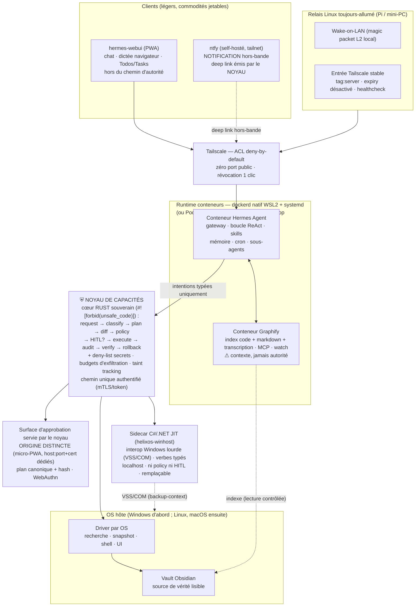

# Agentic OS personnel — Architecture v1.2

> Système d'exploitation agentique self-hosted, **architecture prête pour la
> portabilité (Windows d'abord ; Linux, macOS ensuite)** : Hermes Agent + Graphify
> en conteneurs, un **noyau de capacités** (cœur Rust souverain + sidecar C#/.NET
> pour l'interop Windows lourde + drivers par OS) comme portier unique de l'hôte,
> hermes-webui en PWA via Tailscale, surface d'approbation servie par le noyau sur
> **origine distincte** (micro-PWA), notification hors-bande via **ntfy**, réveil
> et entrée tailnet portés par un **relais Linux toujours-allumé**.

**Statut** : référence — v1.2 (durcissement post-stress-test : rayon de souffle
borné en aval ; runtime natif dockerd/WSL2 (pas Docker Desktop) ; cœur Rust +
sidecar C#/.NET ; surface d'approbation sur origine distincte + ntfy ; relais Linux
en P1 ; taxonomie de rollback inversée `compensation` par défaut ; médias reclassés
local vs LLM requis ; budgets en devise ; kill switch 3 niveaux)
**Constitution applicable** : v1.4.0
**Matériel requis** : une machine capable de faire tourner des conteneurs **+ un
petit relais Linux toujours-allumé** (Pi / mini-PC) sur le LAN. **Un GPU accélère
(vision multimodale, extraction), il n'est jamais requis pour le socle** (code +
transcription CPU) ; l'extraction images/PDF est un vision-LLM (Ollama-GPU ou
cloud par exception).
**Doctrine** : la sécurité est une **topologie**, pas une discipline de l'agent —
mais la topologie borne le **chemin** et la **forme**, jamais le **rayon de
souffle**. **L'agent est présumé compromissible** : la défense en aval (deny-list
secrets, budgets d'exfiltration, taint tracking) complète le portier. L'agent n'a
aucune capacité hôte, sauf celles que le noyau lui loue — une par une, avec preuve,
durée, portée et trace.

> **Note de version (v1.1 → v1.2)** — Amendée depuis le décision-record du
> stress-test (`docs/design/2026-07-06-stress-test-decisions.md`, 4 forks tranchés).
> Changements majeurs : (1) le rayon de souffle est borné en aval, l'agent étant
> présumé compromissible ; (2) le runtime est **dockerd natif WSL2 + systemd (ou
> Podman rootless)**, plus jamais Docker Desktop ; (3) le noyau devient **cœur Rust
> + sidecar C#/.NET JIT** (Principe VIII amendé) ; (4) la surface d'approbation est
> servie sur **origine distincte** + deep link **ntfy** hors-bande + comparaison de
> hash — la webui sort du chemin d'autorité (« zéro fork » abandonné) ; (5) un
> **relais Linux toujours-allumé** (WoL L2 + entrée Tailscale + healthcheck) passe
> en P1 ; (6) la taxonomie de rollback est **inversée** (`compensation` garantie par
> défaut, `auto`/VSS opportuniste) ; (7) les médias sont reclassés **local (code +
> transcription) vs LLM requis (images/PDF/vision)** ; (8) budgets **en devise** +
> kill switch **3 niveaux**. La portabilité redevient un objectif d'architecture,
> pas un acquis.

---

## 0. Les quatre qualités cibles et ce qui les porte

| Qualité | Portée par |
|---|---|
| **Intelligent** | Hermes (skills auto-créées, mémoire, sous-agents) · Graphify (graphe de connaissances **code + markdown + transcription, 100 % local sans GPU**) · **extraction multimodale images/PDF = vision-LLM (Ollama-GPU ou cloud), PAS local-sans-GPU** · retrieval par intentions · routage multi-modèles natif Hermes (`/model`, endpoint local si GPU présent, modèle fort via API) |
| **Autonome** | cron Hermes + budgets d'autonomie par déclencheur (**plafonds en devise**, pas seulement nb d'actions) · file persistante + checkpointing · **Wake-on-LAN via relais tailnet** (magic packet L2 émis en local) · notifications de résultat |
| **Sécurisé** | frontière conteneurisée durcie et **testée** (dockerd natif WSL2) · noyau de capacités (intentions typées, plan signé, HITL gradué) · chemin unique authentifié · audit append-only · Tailscale ACL deny-by-default · **rayon de souffle borné en aval (agent présumé compromissible) : deny-list secrets, budgets d'exfiltration, taint tracking** |
| **Robuste** | **architecture prête pour la portabilité** (contrat unique + drivers par OS ; non acquise tant qu'un 2e driver ne l'a pas prouvée) · **relais Linux toujours-allumé (poste ≠ serveur)** · idempotence (pas de double exécution) · taxonomie de rollback honnête et dégradable · reprise après crash · p95/p99 mesurés sous charge · couplage de versions webui/agent géré |

---

## 1. Vue d'ensemble



Composants **adoptés** : Hermes Agent, Graphify, hermes-webui. À **développer** : le
noyau de capacités — **cœur Rust souverain + sidecar C#/.NET JIT** (interop Windows
lourde) + driver de l'OS courant. La **surface d'approbation est servie par le noyau
sur une origine distincte** (micro-PWA, Web Push) ; la webui n'est plus sur le chemin
d'autorité et redevient une commodité jetable. La notification hors-bande passe par
un **canal ntfy** self-hosté (le contenu — résumé + hash du plan — est émis par le
noyau, jamais par l'agent). Un **relais Linux toujours-allumé** (Pi / mini-PC) porte
le Wake-on-LAN (magic packet L2 émis en local), le point d'entrée Tailscale stable
(`tag:server`, expiry désactivé) et le healthcheck externe — le poste Windows est un
**poste, pas un serveur**. L'entrée vocale du quotidien = la dictée navigateur de
webui (Web Speech API, côté client) ; le pipeline « Jarvis » full streaming est une
extension ultérieure (voir §6).

---

## 2. La frontière — un contrat, un mécanisme par OS

La frontière « l'agent ne touche pas l'hôte » est un **invariant testé** ; son
mécanisme varie selon l'OS. Sur Windows, le runtime est **dockerd natif WSL2 +
systemd (ou Podman rootless)** — **jamais Docker Desktop**, qui réintroduit des
ponts hôte massifs (`\\.\pipe\docker_engine`, bind-mounts Windows automatiques,
moteur cross-distro partagé).

| OS | Isolation du runtime agent | Verrou réseau |
|---|---|---|
| Windows | conteneurs sur distro WSL2 dédiée **durcie** (`automount=off`, `interop=off`, `appendWindowsPath=off`, user non-root), **dockerd natif / Podman rootless** (jamais Docker Desktop) | firewall Hyper-V : NAT + `DefaultOutboundAction=Block` + 1 règle pour le **routé** ; endpoint bindé sur la **gateway WSL** (pas `127.0.0.1`, cf. loopback) |
| Linux | conteneurs (namespaces/cgroups), rootless de préférence ; VM si paranoïa | nftables : seul le port du noyau |
| macOS | la VM de Docker Desktop/OrbStack isole d'office | pf + la VM ne voit que le port du noyau |

**WSL2 = réduction de surface, PAS frontière de VM.** `automount/interop/`
`appendWindowsPath=off` fuient (bugs MS) et durcissent surtout Linux→Windows ;
l'exposition host→distro (`\\wsl$`, vhdx offline, NAT) subsiste. Le durcissement
réduit la surface d'attaque, il ne pose pas une frontière hyperviseur.

Règles communes aux trois :
- Les conteneurs ne montent **que** leurs volumes déclarés (état Hermes, miroir
  lecture seule pour Graphify). Aucun bind mount du filesystem hôte complet —
  c'est le trou classique qui réintroduit ce que le durcissement fermait.
- **Interdits explicitement testés** (le compose ne doit jamais les contenir) :
  montage de `docker.sock`, `network_mode: host`, `privileged`, `pid: host`,
  `ipc: host`, `/dev/shm` de l'hôte. **Revue manuelle du compose à chaque
  changement**, en plus du harness.
- **Verrou réseau « un seul port »** : vrai pour le **routé** (NAT +
  `DefaultOutboundAction=Block` + 1 règle), **pas pour le loopback**
  (`LoopbackEnabled` est un toggle **global**, pas par-port) → binder l'endpoint
  du noyau sur la **gateway WSL**, jamais `127.0.0.1`.
- **mTLS par cert client par conteneur** : l'**identité est le cert, pas le
  réseau**. Le noyau authentifie chaque appelant — la provenance réseau n'est pas
  une identité. Tailscale protège l'accès au service ; le noyau protège les actions.
- **Le harness de tests de contournement est paramétré par OS et tourne depuis
  l'intérieur des conteneurs ET depuis le runtime** (tests 1-3, 10). Sa promesse
  est bornée : il **prouve que les réglages tiennent et régresse s'ils sont
  relâchés** — **jamais** « prouve l'inévasibilité ». WSL2 n'est pas une VM ; le
  harness verrouille une configuration, il ne démontre pas l'impossibilité d'évasion.

---

## 3. Le noyau de capacités — cœur Rust souverain + sidecar C#/.NET + drivers

Composant souverain. Architecture **cœur Rust + sidecar C#/.NET JIT** (tranché en
SPEC-002 ; le noyau n'est plus « un seul binaire » — Principe VIII amendé).

- **Cœur Rust** — binaire statique, service Windows, `#![forbid(unsafe_code)]` sur
  le cœur. Porte : mTLS (`rustls`, révocation CRL native), plan signé,
  authentification WebAuthn (`webauthn-rs`), policy, HITL, audit, idempotence,
  quotas, et le **contrat `DriverHost` (zéro concept OS)**. Go a été éliminé
  (pas de révocation mTLS dans la stdlib ; VSS backup-context impossible via WMI).
- **Sidecar C#/.NET JIT** (`helixos-winhost`) — interop Windows lourde (VSS
  backup-context via AlphaVSS, COM) que le FFI Rust rend douloureuse. **Ni policy,
  ni HITL, ni auth d'appelant** : il n'exécute que des **verbes typés déjà
  validés/approuvés** par le cœur, en **localhost only**, authentifié par le cœur,
  audité avec le `plan_hash`. « Une main, pas une tête. » Composant **remplaçable**.
- **Séquencement** : le cœur Rust + driver léger (recherche + PowerShell
  out-of-proc + fichiers) est **livrable sans le sidecar** ; sans lui, `snapshot`
  se dégrade en `compensation`. Le sidecar VSS arrive **tard, isolé, optionnel**.
  Plan B documenté : monolithe C#/.NET JIT si le split coûte trop cher au solo.

### 3.1 Invariant central

> Aucune action hôte n'existe comme API brute. Toute action hôte est une
> **intention typée**, validée, éventuellement approuvée, exécutée, journalisée
> et réversible quand c'est possible.

Interdit en surface normale : `run_powershell(cmd)`, `run_bash(cmd)` et tout
équivalent freeform (mode admin exceptionnel uniquement, HITL fort + passkey).

### 3.2 Contrat portable, implémentation par driver

Le **catalogue d'intentions souverain ne contient aucun concept spécifique à un
OS** ; l'OS-spécifique est confiné aux drivers. **Obsidian n'est pas un concept
OS** : ses intentions sortent du cœur souverain vers un **catalogue applicatif
distinct** (`app.obsidian.*`), servi par le noyau mais hors du contrat `DriverHost`.

```
# Cœur souverain (DriverHost, zéro concept OS)
host.search_files(query, scope)
host.read_file(path)            # deny-list de secrets → force L2 (cf. §3.4)
host.propose_file_patch(path, patch)
host.apply_file_patch(plan_id)
host.rollback(operation_id)
host.open_app(app_id)
host.run_approved_script(script_id, parameters)

# Catalogue applicatif (hors cœur souverain)
app.obsidian.create_note(vault, path, content)
app.obsidian.patch_note(vault, path, diff)
```

| Capacité | Driver Windows | Driver Linux | Driver macOS |
|---|---|---|---|
| Recherche par nom | Everything **ou** Windows Search **ou** USN/MFT (remplaçable, valider par spike) | plocate / fd | Spotlight (mdfind) |
| Snapshot (`rollback: auto`, opportuniste) | VSS (via sidecar, derrière probe) | Btrfs/ZFS (sinon copie) | APFS snapshot |
| Shell approuvé | PowerShell (out-of-proc) | bash | zsh |
| Automation UI (optionnel) | UI Automation | AT-SPI (dégradé) | Accessibility (TCC) |
| Service | Service Windows | systemd | launchd |

**Taxonomie de rollback inversée — `compensation` garantie par défaut.** La classe
**garantie par défaut** est `compensation` (copie-aside + `ReplaceFile` atomique,
déterministe, tout filesystem, sans élévation). `auto` (VSS) est une **exception
opportuniste** derrière un probe (NTFS fixe + writers sains + espace + élévation),
**un snapshot par lot, jamais par fichier**. La classe est **observée** par le
driver au runtime, **jamais promise** par le contrat : une classe observée n'est
jamais surdéclarée, et sans snapshot natif un patch reste simplement en
`compensation`.

> Justification (vérité-terrain VSS) : VSS est par-volume (jamais par-fichier), gel
> writer de plusieurs secondes, se perd sous I/O, échoue disque plein ; seul COM
> `IVssBackupComponents` est supporté client (absent de win32metadata → FFI Rust
> douloureux ; AlphaVSS C#/C++CLI incompatible AOT → **sidecar JIT**). D'où : VSS
> opportuniste et tardif, `compensation` comme socle.

Séquencement : le contrat est **prêt pour la portabilité** dès le premier jour ;
**un seul driver implémenté d'abord** (l'OS de la machine principale, Windows), les
autres en extensions.

### 3.3 Pipeline, plan signé, audit

```
request → normalize → classify risk → plan → diff → policy decision
        → optional HITL → execute (driver) → audit → verify → rollback handle
```

- Plan **canonique, hashé sha256, usage unique, TTL court** ; l'humain signe le
  plan, pas le texte affiché ; **anti-TOCTOU** : hash de la cible au moment du
  diff, refus + re-diff si elle a changé.
- Taxonomie de rollback : `compensation` (**garantie par défaut**) / `auto`
  (**opportuniste, observé au runtime**) / `irreversible` — affichée dans la carte
  d'approbation, la classe observée n'est jamais promise ni surdéclarée (cf. §3.2).
- **Idempotence** : un plan s'exécute au plus une fois ; crash/restart sans
  double exécution ; quotas par appelant.

Objet d'audit (append-only) — `subagent_id` est un **hint déclaratif** (debug /
imputation de coûts) **sans valeur de sécurité** ; la traçabilité fiable repose sur
le **credential mTLS + le plan signé**, pas sur ce champ :

```json
{
  "operation_id": "op_...",
  "caller": "hermes-agent",
  "subagent_id": "sub_recherche",     // hint déclaratif, sans valeur de sécurité
  "source": "container",
  "tool": "app.obsidian.patch_note",
  "risk": "medium",
  "target": "vault://Notes/Projet.md",
  "plan_hash": "sha256:...",
  "target_hash_at_diff": "sha256:...",
  "approval_id": "appr_...",
  "rollback": { "type": "compensation", "available": true, "id": "rb_..." },
  "driver": "windows",
  "started_at": "...", "ended_at": "...",
  "result": "success",
  "trace_id": "tr_..."
}
```

### 3.4 Défense en aval — l'agent est présumé compromissible

Le portier borne le **chemin** et la **forme**, jamais le **rayon de souffle** une
fois qu'un agent compromis détient le credential légitime du noyau (prompt injection
non résolu en 2026). Défenses **en aval**, dans le cœur :

- **Bail de portée (allowlist positive) — contrôle PRIMAIRE** : par défaut une
  intention n'opère que dans les **scopes loués à la tâche** à son déclenchement
  (racines déclarées) ; hors bail → **refus**. Bail **par-tâche** (jamais global —
  pas d'héritage de l'union des portées), non élargissable par le contenu déclencheur.
  L'allowlist limite le rayon de souffle ; la deny-list ci-dessous rattrape les oublis.
- **`host.read_file` porte une deny-list de secrets** (`*.env`, `*.key`, `*.pem`,
  `id_*`, `*.kdbx`, `.ssh/`, `.hermes/`, stores de credentials Windows) → **défense
  en profondeur** (seconde couche, pas la première) : toute lecture concernée **force
  L2 + passkey, même en lecture seule et même dans un scope loué**.
- **Budgets d'exfiltration** : volume cumulé lu + nb de fichiers distincts sur
  fenêtre glissante, **orthogonaux aux quotas par-action**.
- **Credential du noyau non lisible** par aucune intention (hors volumes montés
  lisibles).
- **Taint tracking** : une action influencée par du contenu non fiable lu dans le
  tour **ne peut pas être auto-approuvée (L0)** → +1 cran HITL. Étend le principe
  SPEC-006 (« le déclencheur n'élargit pas la politique ») à **tout contenu lu**.

---

## 4. HITL gradué, surface d'approbation souveraine

Trois niveaux (anti-fatigue d'approbation) :

| Niveau | Classe d'action | Mécanisme |
|---|---|---|
| L0 auto | lecture sûre (hors deny-list secrets, cf. §3.4) | audit seul, zéro friction |
| L1 léger | écriture faible réversible | tap d'approbation |
| L2 fort | destructif, externe, irréversible, admin, **lecture de secret** | passkey (WebAuthn), plan signé, diff complet, **comparaison de hash (≥ 4 premiers octets)** |

**Contrat de carte d'approbation** (livrable de premier ordre, conçu *contre*
l'approbation mécanique) — la carte répond à cinq questions, dans cet ordre :
1. **Quoi** — diff complet + résumé en une ligne. 2. **Où** — cible + scope loué.
3. **Risque** — niveau + classe de **rollback réel** (honnête, jamais surdéclarée).
4. **Pourquoi** — la tâche/déclencheur à l'origine, avec un **drapeau explicite si
l'action a été influencée par du contenu non fiable** (le signal de taint rendu
visible). 5. **Inhabituel ?** — ce qui **dévie du comportement normal** (« 1re fois
qu'un cron écrit hors `~/vault` »), pas seulement le diff : un diff déjà vu 200 fois
se tamponne, une déviation non. La carte porte aussi identité de tâche + `subagent_id`
(hint déclaratif), hash du plan, expiration. **Lisibilité testée** ; le taux L1/L2 est
mesuré pour calibrer l'anti-fatigue.

**La surface d'approbation est servie par le noyau sur une origine distincte**
(micro-PWA — host:port + certif dédiés, `frame-ancestors 'none'`,
`X-Frame-Options: DENY`), ouverte **hors de toute vue contrôlable par la webui**.
Le **deep link est livré hors-bande par ntfy** (self-hosté dans le tailnet) ; le
**contenu** (résumé + hash du plan) est émis par le **noyau**, jamais par l'agent.
La webui **sort du chemin d'autorité** : elle ne transporte plus qu'un deep link et
redevient une commodité jetable (« zéro fork » abandonné). Le rendu canonique du
plan et la vérification passkey viennent du composant souverain. Un agent ou une
webui compromis ne peut pas afficher un diff trompeur — et approuver/refuser reste
possible même Hermes éteint.

> **Le passkey prouve « l'humain a cliqué », pas « l'humain a vu la vérité ».**
> C'est pourquoi l'origine distincte (hors détournement de contexte same-device),
> le contenu émis par le noyau et la **comparaison de hash exigée pour les L2**
> sont nécessaires : sans elles, un passkey signe un consentement à un diff
> potentiellement trompeur.

**ntfy = notification uniquement** ; il n'approuve jamais seul une action L2
(WhatsApp reste une commodité optionnelle non fiable). La dictée/le vocal client
n'approuve jamais L1/L2.

**Traçabilité des délégations** : les sous-agents partagent le credential de leur
parent ; le `subagent_id` est un **hint déclaratif sans valeur de sécurité** (cf.
§3.3) — la traçabilité fiable repose sur le credential mTLS + le plan signé. Le
routage multi-modèles est une configuration déclarative (mécanique native Hermes ;
endpoint local seulement si un GPU est présent, sinon API).

---

## 5. Mémoire — trois couches, une seule vérité

| Couche | Rôle | Règle |
|---|---|---|
| Vault Obsidian (hôte) | vérité humaine, durable, éditable, versionnable Git | toute mutation passe par le noyau |
| Graphify | index dérivé, interrogeable (MCP), reconstructible | jamais source de vérité, jamais autorité |
| Mémoire Hermes | contexte conversationnel, préférences, skills | limitée à l'utile ; pas de duplication du vault |

Tout contenu lu (email, fichier, note, chunk, écran) est une **donnée non
fiable**, jamais une instruction. Testé en acceptance (test 6).

**Secrets — jamais en clair dans le runtime.** Les secrets ne résident pas en clair
dans `.env` (violation du Principe I) : exiger **Hermes ≥ 0.16.0** (contrainte
versionnée), secrets en **0600** / externalisés, et la **clé du noyau cloisonnée
hors `.env`**, illisible par toute intention (renforcé par la deny-list secrets de
§3.4).

---

## 6. Médias et calcul — local (code + transcription) vs LLM requis (vision)

Le pipeline vocal temps réel (STT/TTS streaming, wake word, ordonnanceur GPU
préemptif) est **retiré du périmètre** et conservé en extension ultérieure — il
était le seul composant exigeant un GPU puissant en latence critique.

L'axe réel n'est **pas CPU vs GPU** mais **local vs LLM requis** :

- **Socle 100 % local (sans GPU)** : indexation **code + markdown** + **transcription
  faster-whisper int8 sur CPU** (confirmé verbatim, vraiment local). En heures
  creuses ; si un GPU est présent (CUDA/MPS), il **accélère, il n'est jamais requis**
  pour ce socle.
- **LLM requis (hors socle)** : l'extraction **images / PDF / vision** est un
  **vision-LLM** — **Ollama-GPU ou cloud par exception**, jamais le socle. (La
  « vision légère (captions, OCR) sur CPU » est **supprimée** : elle n'existe pas
  honnêtement.)
- **Entrée vocale du quotidien** : dictée navigateur (Web Speech API) de
  hermes-webui — tourne côté client, zéro charge serveur.
- **Fraîcheur du vault** : **déclenchée par le noyau à chaque mutation validée**
  (le watch Graphify ne reconstruit pas le markdown) ; fraîcheur < 1 min pour le
  code.
- **Budgets en devise + anti-boucle** : l'extraction/backfill tourne par défaut sur
  Haiku/Ollama, sous plafonds **en devise** appliqués par le noyau ; un **garde
  anti-boucle** sur l'orchestrateur Graphify empêche la ré-extraction vision-LLM en
  boucle (des centaines de $/nuit).
- Option par policy : API cloud pour les gros backfills de médias non sensibles
  (entorse de souveraineté explicite, jamais par défaut).
- Invariant de réactivité : les jobs lourds ne dégradent jamais l'interactif
  (PWA/chat) — vérifié au p95 sous charge (test 8).

---

## 7. Autonomie (cron Hermes + budgets en devise)

- Chaque déclencheur (cron, watcher, webhook) porte une **politique d'autonomie** :
  intentions autorisées en auto, plafonds **en devise** (jour/mois, par déclencheur
  + global) **et** en nb d'actions / fenêtre horaire, le reste → HITL. Le
  dépassement de plafond déclenche une **PAUSE auto**. Le contenu déclencheur ne
  peut jamais élargir la politique de sa tâche.
- File persistante, checkpointing, reprise ; **Wake-on-LAN via le relais** (magic
  packet L2 émis en local — WoL est L2, Tailscale est L3, donc pas de réveil
  « via tailnet » depuis l'extérieur).
- **Kill switch à 3 niveaux**, chronométrés et testés, depuis la PWA :
  - **PAUSE (< 5 s)** — suspend l'ordonnancement.
  - **ABORT (best-effort)** — interrompt les opérations en vol proprement.
  - **HALT (brutal)** — arrêt immédiat.
  Le kill doit **tuer les process hôte enfants** (`run_approved_script`), pas juste
  suspendre les crons.
- **Expiry de clé Tailscale désactivé** sur le poste et le relais (nœud
  `tag:server`) — évite le lockout silencieux à J+180.
- Notifications : alertes de complétion webui + WhatsApp en secours.

---

## 8. Observabilité et suivi

- Traces complètes pensée→intention→plan→décision→résultat (`trace_id`), coût
  tokens et latence par étape ; sessions rejouables.
- **L'audit du noyau vit hors du SQLite fragile de Hermes** (store append-only
  dédié au cœur), avec **rotation et rétention** explicites — l'audit ne doit pas
  dépendre de la robustesse d'un composant adopté.
- Suivi des tâches : Todos/Tasks/Kanban de webui ; à terme, vue kanban custom sur
  l'audit du noyau (seule à connaître « en attente d'approbation »).
- **Notification de réveil / d'événement via ntfy** (hors-bande), + un **« rapport
  de nuit »** en digest (ce qui a tourné, coûts en devise, actions en attente
  d'approbation).
- Contrainte d'exploitation : webui et hermes-agent se mettent à jour **ensemble**.

---

## 9. Tests d'acceptance

§9 est la **source unique** de la matrice test↔SPEC.

| # | Test | Attendu | SPEC |
|---|---|---|---|
| 1 | Depuis le conteneur ET le runtime : exécuter un binaire hôte, accéder au filesystem hôte, au vault | **Échec** | SPEC-001 |
| 2 | Depuis le conteneur : joindre un port hôte non prévu | **Échec** (verrou réseau par OS ; loopback bindé sur gateway WSL) | SPEC-001 |
| 3 | Appeler le noyau **sans credential** | **Échec** | SPEC-002 |
| 4 | Hermes → recherche de fichiers via intention | Autorisé, audité, sans HITL (L0) | SPEC-002 |
| 5 | Hermes → modification note Obsidian | Diff affiché, approbation, application, rollback dispo | **SPEC-004** |
| 6 | Éval adversariale continue (prompt injection sur contenu lu) | **Taux de compromission < seuil** (métrique continue, pas pass/fail) | SPEC-003 |
| 7 | Tâche cron veut écrire hors politique | Notification + approbation traçable | SPEC-006 |
| 8 | Indexation médias lourde en cours | Réactivité PWA/chat inchangée (p95, load-generator synthétique) | SPEC-005 |
| 9 | Crash/restart du noyau pendant une opération | Pas de double exécution, état récupérable | SPEC-002 |
| 10 | Révocation Tailscale d'un client | Accès coupé, services internes inchangés | SPEC-001 |
| 11 | Tentative d'approbation ntfy/WhatsApp d'une action L2 | Refus / redirection vers la surface souveraine (origine distincte) | SPEC-003 |
| 12 | Cible modifiée entre diff et apply (TOCTOU) | Refus, re-diff, re-approbation | SPEC-002 |
| 13 | Rejeu d'un plan déjà exécuté ou expiré | Refus (usage unique, TTL) | SPEC-002 |
| 14 | Hermes/webui éteints ou compromis : approuver/refuser une opération en vol | Fonctionne (surface servie par le noyau, origine distincte + ntfy) | SPEC-003 |
| 15 | Rollback annoncé `auto` sur un hôte sans snapshot natif | Reste en `compensation`, jamais surdéclaré | SPEC-002 |
| 16 | **Disque à 95 %** pendant un patch | La **classe de rollback reste honnête** (VSS échoue proprement → `compensation`) | SPEC-002 |
| 17 | **Kill `HALT` (panic)** pendant un `run_approved_script` | **Process hôte enfant terminé < 5 s** | SPEC-BUDGET / kill switch |
| 18 | **Backup / restore** de `~/.hermes` + SQLite (`.backup` + `integrity_check`) | **Restauration testée pour de vrai** (jamais `cp` sur WAL) | RUNBOOK-BACKUP-RESTORE |
| 19 | **Lecture d'un fichier de la deny-list secrets** (`*.env`, `*.key`, `.ssh/`, …) | **Force L2 + passkey**, même en lecture seule | SPEC-002 / §3.4 |
| 20 | **Intention hors du bail de portée** loué à la tâche | **Refus** (allowlist positive = contrôle primaire ; deny-list = 2ᵉ couche) | SPEC-002 / §3.4 |

> Le test 6 était auparavant un pass/fail non falsifiable (« donnée ≠ instruction ») :
> il devient une **éval adversariale continue** (taux de compromission mesuré sous
> un seuil). La déduplication du TOCTOU (ex-tests 002/003) est actée : **une seule
> occurrence (test 12)**.

---

## 10. Ordre de construction

1. **P1 — infrastructure de fait** : **relais Linux toujours-allumé** (WoL L2 +
   entrée Tailscale `tag:server` expiry désactivé + healthcheck) + **runtime natif**
   (dockerd WSL2 + systemd / Podman rootless, **pas Docker Desktop**) ; frontière
   durcie + harness → jusqu'à ce que les tests 1-3 **échouent réellement**.
2. Noyau : **cœur Rust souverain** + contrat `DriverHost` + **driver de l'OS
   principal (léger : recherche + PowerShell out-of-proc + fichiers)** ; policy,
   plan/apply, audit (hors SQLite Hermes), rollback (**`compensation` par défaut**),
   idempotence, deny-list secrets + budgets d'exfiltration + taint tracking. Le cœur
   est **livrable sans le sidecar** : en attendant, `snapshot` = `compensation`.
3. Surface d'approbation servie par le noyau sur **origine distincte** (micro-PWA) +
   deep link **hors-bande ntfy** + comparaison de hash L2 ; plans signés.
4. Premiers usages hôte : Obsidian (`app.obsidian.*`) + recherche de fichiers
   (via driver).
5. Graphify en lecture/indexation (**socle local code + markdown + transcription
   CPU**, heures creuses).
6. Autonomie cron avec **budgets en devise**, **kill switch 3 niveaux**, notifications.
7. **Tard, isolé, optionnel** : **sidecar C#/.NET (VSS backup-context)** → active la
   classe `auto` opportuniste derrière probe.

**Runbooks associés (roadmap v4)** : `RUNBOOK-BACKUP-RESTORE` (+ 3-2-1),
`SPEC-UPGRADE` (blue/green, pin par digest sha256), `RUNBOOK-COLDSTART`
(dockerd/WSL2 natif, auto-start, dépendances + healthchecks, relais),
`SPEC-BUDGET-COÛT` (plafonds en devise, anti-boucle) et
`RUNBOOK-DÉGRADATION` (kill switch 3 niveaux, disque-plein→VSS honnête).

**Extensions ultérieures** : drivers Linux puis macOS complets · **vision
multimodale images/PDF (vision-LLM Ollama-GPU ou cloud par exception)** · pipeline
vocal full streaming + ordonnanceur GPU (spec conservée) · Swarm Mode (workspace) ·
voix custom RVC · client Tauri mobile · `host.ui_automation` · mémoire procédurale.
Le **relais Linux** et la **vision multimodale** sont désormais des extensions
explicitement nommées (le relais est avancé en P1 de fait).
