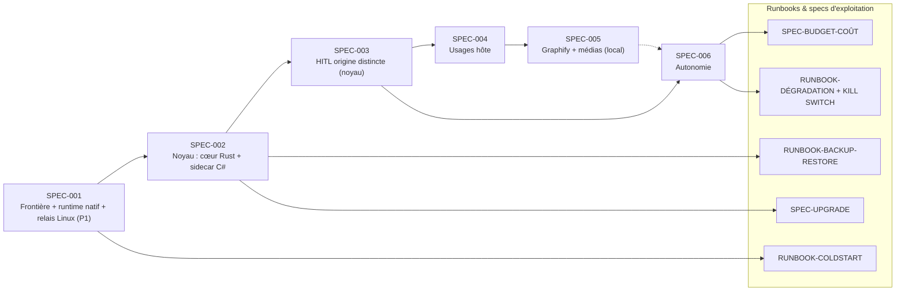

# Roadmap Spec Kit v4 — construction par étapes

Six specs + cinq runbooks/specs d'exploitation. Système **portable
(Windows/Linux/macOS)**, conteneurisé, **sans exigence GPU**. La frontière
d'abord, le noyau ensuite, l'autonomie en dernier — puis les runbooks qui le
rendent vivable un an, seul, depuis un téléphone. Amendé depuis le décision-record
du stress-test (`docs/design/2026-07-06-stress-test-decisions.md`) : runtime
**natif** (dockerd WSL2 + systemd, pas Docker Desktop) et **relais Linux
toujours-allumé (P1)** arrivent avec SPEC-001 ; cœur **Rust** + sidecar C#/.NET ;
surface HITL sur origine distincte via ntfy ; médias Graphify = code + markdown +
transcription 100 % local. Prompts `/specify` prêts à copier, puis `/clarify` →
`/plan` → `/tasks`.

---

## MVP-0 — Tranche verticale minimale (walking skeleton)

**Avant les six SPEC pleines**, une tranche verticale **brutalement réduite** qui
traverse frontière → noyau → **une seule intention utile** → approbation → audit →
rollback, et qui doit devenir **agréable à utiliser au quotidien, au bureau, AVANT**
tout élargissement. Le principal risque du projet n'est pas architectural, c'est la
**complexité opérationnelle** : on ne construit pas une infrastructure quasi
industrielle avant d'avoir une boucle fluide.

**Périmètre IN (le strict nécessaire)** :
- Frontière runtime→hôte **prouvée** (harness : tests 1, 2 échouent ; runtime natif
  dockerd/WSL2). **Le relais Linux et l'accès mobile sont HORS MVP-0** — ils servent
  le réveil à distance, pas « la boucle est-elle agréable au bureau ».
- **Noyau Rust minimal** : auth mTLS de l'appelant, pipeline d'**une** intention
  (normalize→plan→diff→policy→HITL→execute→audit→verify), plan signé (hash/TTL),
  idempotence, **bail de portée** (allowlist) limité au vault.
- **Une seule intention utile** : rechercher / lire / **proposer+appliquer un patch
  sur une note du vault**, au niveau **fichier** (`host.read_file` +
  `host.propose_file_patch` + `host.apply_file_patch`) — **pas** la couche sémantique
  `app.obsidian.*` (une note = un fichier markdown).
- **Approbation simple mais déjà hors webui** : micro-page servie par le noyau sur
  origine distincte, L1 tap / L2 passkey, **carte d'approbation lisible** (contrat
  §4 de l'architecture). En local/tailnet ; ntfy-away non requis au bureau.
- **Audit append-only** + **rollback `compensation`** (copie-aside + `ReplaceFile`,
  **sans VSS, sans sidecar**).
- **Plancher opérationnel mince** : backup du vault (Git) + de l'audit/état du noyau,
  et un **redémarrage propre**. On ne gèle pas *tout* l'opérationnel : sans backup ni
  restart, « agréable à utiliser » veut dire « jusqu'au premier crash ».

**Gelé tant que la tranche n'est pas agréable** : VSS / rollback `auto`, **sidecar
C#**, **Graphify** (tout — pas de graphe de connaissances ; la recherche MVP-0 reste
simple/par nom), **vision**, **autonomie cron**, **budgets** (pas d'autonomie = pas
d'emballement), **kanban**, **upgrade blue/green sophistiqué**, drivers multi-OS,
**relais / accès mobile**.

**Sortie** : une note du vault se cherche, se lit, se patche par une intention
approuvée hors webui, auditée, annulable — **et l'utiliser au quotidien est fluide**.
C'est le feu vert pour dégeler la suite (SPEC-001 complète → 002 → …).

---

## SPEC-001 — La frontière : runtime natif durci + relais Linux (P1) + harness par OS

**Objectif** : rendre la frontière runtime→hôte réelle et **prouvée**, de façon
portable, sur un **runtime natif** (pas Docker Desktop) et avec le **relais Linux
toujours-allumé** qui rend la workstation-poste opérable comme un service. Rien
d'autre ne se construit tant que les tests de contournement n'échouent pas.

**Runtime — dockerd natif, pas Docker Desktop** : sous Windows, le runtime est
**dockerd natif dans la distro WSL2 durciе, lancé par systemd (ou Podman rootless)**,
**jamais Docker Desktop**. Motivation (vérité-terrain) : Docker Desktop réintroduit
des **ponts hôte massifs** (`\\.\pipe\docker_engine`, bind-mounts Windows
automatiques, moteur cross-distro partagé) et **ne démarre pas sans session
interactive** — inacceptable pour un poste opéré depuis un téléphone. La frontière
WSL2 est une **réduction de surface, pas une frontière de VM** : `automount/interop/
appendWindowsPath=off` durcissent surtout Linux→Windows et fuient (bugs MS) ;
l'exposition host→distro (`\\wsl$`, vhdx offline, NAT) subsiste — d'où le verrou
réseau et mTLS ci-dessous.

**Relais Linux toujours-allumé (P1)** : un petit relais Linux (Pi / mini-PC) sur le
LAN, allumé en permanence, porte (a) le **magic packet Wake-on-LAN** vers la
workstation (**WoL est L2, Tailscale est L3** — le réveil est impossible depuis le
tailnet directement), (b) un **point d'entrée Tailscale stable** (nœud `tag:server`,
**expiry de clé désactivé** pour éviter le lockout silencieux à J+180), et (c) le
**healthcheck externe**. C'est l'extension « machine dédiée » de la roadmap, **avancée
en P1 de fait**.

**Périmètre IN** : runtime conteneurs natif selon l'OS (Windows : distro WSL2 dédiée
durcie — `automount=off`, `interop=off`, `appendWindowsPath=off`, user non-root —
portant **dockerd natif + systemd, ou Podman rootless** ; Linux : Docker/Podman
rootless ; macOS : VM Docker/OrbStack) ; **relais Linux P1** (WoL + entrée Tailscale
`tag:server` expiry désactivé + healthcheck) ; `docker-compose.yml` en livrable :
services hermes-agent et graphify, volumes nommés pour l'état (mémoire, skills,
sessions), **aucun bind mount du filesystem hôte** ; **interdits explicitement testés
dans le compose** : montage de `docker.sock`, `network_mode: host`, `privileged`,
`pid: host`/`ipc: host`, `/dev/shm` hôte ; verrou « un seul port » = **le port routé**
(NAT + `DefaultOutboundAction=Block` + une règle), **pas le loopback** (`LoopbackEnabled`
est un toggle global, pas par-port) → **binder l'endpoint sur la gateway WSL, jamais
`127.0.0.1`** ; **mTLS par cert client par conteneur** (l'identité est le cert, pas le
réseau) ; verrou réseau par OS (firewall Hyper-V / nftables / pf) ; Tailscale avec ACL
deny-by-default ; accès PWA mobile (passkeys webui) ; **harness de tests de
contournement scripté, paramétré par OS, exécuté depuis l'intérieur des conteneurs
ET depuis le runtime** (implémenté et exécuté sur l'OS principal d'abord) ;
politique de routage de modèles en configuration déclarative (modèle fort via API ;
endpoint local **optionnel si GPU présent** — jamais requis) ; vérification dans
les docs Hermes de l'épinglage d'un modèle par sous-agent (à défaut : instances
séparées) ; procédure de mise à jour couplée hermes-agent/hermes-webui.
**Note WebAuthn (préparation SPEC-003)** : le RP ID sera le **nom MagicDNS**
`helix.<tailnet>.ts.net` (`ts.net` ∈ Public Suffix List → eTLD+1 propre) et le secure
context viendra de `tailscale cert` (Let's Encrypt) — jamais l'IP `100.x`.
**Périmètre OUT** : toute capacité hôte (le noyau n'existe pas — Hermes ne peut
RIEN faire sur l'hôte, c'est voulu et vérifié) ; drivers des OS secondaires.

**Prompt `/specify`** :
> Mettre en place la frontière de sécurité d'un agentic OS personnel portable :
> un runtime de conteneurs **natif** isolé de l'hôte (sous Windows : distro WSL2
> dédiée et durcie — automount, interop et appendWindowsPath désactivés,
> utilisateur non privilégié — hébergeant **dockerd natif lancé par systemd, ou
> Podman rootless — jamais Docker Desktop, qui rouvre des ponts hôte et ne démarre
> pas sans session** ; conception prête pour Docker rootless sous Linux et VM
> Docker sous macOS), avec un docker-compose portant Hermes Agent et Graphify en
> services séparés, volumes nommés pour l'état persistant, aucun bind mount du
> filesystem hôte. Interdire **et tester explicitement dans le compose** tout
> montage de docker.sock, network_mode host, privileged, pid/ipc host et /dev/shm
> hôte. Le réseau n'autorise que l'unique port **routé** réservé au futur noyau de
> capacités — endpoint **bindé sur la gateway WSL, jamais sur 127.0.0.1** (le
> loopback Hyper-V n'a pas de filtrage par-port) — verrou réseau par OS (firewall
> Hyper-V + DefaultOutboundAction Block, nftables ou pf), et l'identité de chaque
> conteneur est un **cert client mTLS dédié**, pas son adresse réseau. Provisionner
> un **relais Linux toujours-allumé** (Pi ou mini-PC sur le LAN) qui porte le
> magic packet Wake-on-LAN vers la workstation (WoL est L2, hors tailnet), un
> point d'entrée Tailscale stable en nœud tag:server **avec expiry de clé
> désactivé**, et un healthcheck externe. Accès mobile via Tailscale avec ACL
> explicites deny-by-default et passkeys hermes-webui. Livrer un harness de tests
> de contournement scripté, rejouable et paramétré par OS, exécuté depuis
> l'intérieur des conteneurs et depuis le runtime, prouvant que l'exécution de
> binaires hôte, l'accès au filesystem hôte et au vault, et tout port hôte non
> prévu échouent, que chacun des interdits de compose ci-dessus est refusé, et que
> la révocation Tailscale d'un client coupe l'accès sans toucher les services.
> Configurer le multi-modèles : modèle fort via API et endpoint local compatible
> OpenAI optionnel si un GPU est présent (jamais requis), avec une politique de
> routage documentée, un test du changement de modèle en conversation (/model)
> et de l'épinglage d'un modèle par sous-agent. Documenter la mise à jour couplée
> hermes-agent/hermes-webui. Critère : le harness **prouve que les réglages de
> durcissement et les montages tiennent, et régresse (échoue) si on en relâche
> un** — il ne prétend jamais démontrer une inévasibilité absolue.

**Sortie** : Hermes utilisable en chat (et dictée navigateur) depuis le téléphone,
structurellement incapable de toucher l'hôte, sur runtime natif, réveillable via le
relais. Harness vert (et rouge si on relâche un réglage). Tests 1, 2, 10
(le test 3 « appel sans credential » appartient à SPEC-002, où le noyau existe).

---

## SPEC-002 — Le noyau de capacités : cœur Rust + driver + sidecar C#/.NET JIT

**Objectif** : le composant souverain, conçu **prêt pour la portabilité** dès le
premier jour (portabilité prouvée seulement au 2e driver). Le
langage est **tranché** : **cœur Rust**, avec un **driver-sidecar C#/.NET JIT**
pour l'interop Windows lourde. Le MVP est livrable **sans le sidecar**.

**Langage tranché — Rust, pas Go** : le cœur est en **Rust** (`rustls` avec
**révocation CRL native**, `webauthn-rs`, `#![forbid(unsafe_code)]` sur le cœur,
binaire statique, service Windows). **Go est explicitement écarté** : pas de
révocation mTLS dans la stdlib, et le backup-context VSS est impossible via WMI —
deux invariants constitutionnels à recoder. Le cœur porte : mTLS, plan signé,
policy, HITL, audit, idempotence, quotas, et le **contrat `DriverHost` (zéro concept
OS)**.

**Sidecar C#/.NET JIT (`helixos-winhost`)** pour l'interop Windows que Rust n'atteint
pas proprement (VSS backup-context via AlphaVSS, COM). Il n'exécute que des **verbes
typés déjà validés et approuvés par le cœur**, en **localhost only**, authentifié par
le cœur, audité avec le `plan_hash`. **Ni policy, ni HITL, ni auth d'appelant** :
« une main, pas une tête ». Remplaçable. **Il exige l'amendement du Principe VIII de
la constitution (v1.4.0)** : le noyau n'est plus « un seul binaire ». Le sidecar
n'est livré qu'**en JIT** (AlphaVSS est incompatible AOT), **tard, isolé, optionnel**.
Plan B documenté : monolithe C#/.NET JIT si le split coûte trop cher au solo.

**Le sidecar est OUT du MVP** : le cœur Rust + driver léger (recherche + PowerShell
out-of-proc + fichiers) est **livrable seul** ; sans le sidecar, l'intention
`snapshot` **se dégrade en `compensation`** (voir taxonomie inversée).

**Taxonomie de rollback — INVERSÉE (dégradation honnête)** : la classe garantie **par
défaut** est `compensation` (copie-aside + `ReplaceFile` atomique, déterministe, tout
filesystem, sans élévation). `auto` (VSS) est une **exception opportuniste derrière un
probe** (NTFS fixe + writers sains + espace disque + élévation), **un snapshot par lot,
jamais par fichier**. La classe `irreversible` reste explicite. La classe est
**observée par le driver au runtime, jamais promise par le contrat** — on ne promet
jamais mieux que `compensation`, on constate `auto` quand le probe passe.

**Secrets hors runtime** : la **clé du noyau est cloisonnée hors de tout volume monté
lisible, illisible par intention** (aucune intention ne peut la lire). En complément,
une **deny-list de secrets** sur `host.read_file` (L2) : `*.env, *.key, *.pem, id_*,
*.kdbx, .ssh/, .hermes/`, stores de credentials Windows → force **L2 + passkey même en
lecture**.

**Périmètre IN** : **cœur Rust** en service natif (`rustls`/CRL, `webauthn-rs`,
`#![forbid(unsafe_code)]`, binaire statique) ; authentification par appelant
(mTLS/token) ; **contrat d'intentions sans aucun concept spécifique à un OS**
(`DriverHost`), l'OS-spécifique confiné à une interface de driver (recherche, lecture,
patch, snapshot, scripts approuvés, notes Obsidian — voir SPEC-004 pour le catalogue
applicatif) ; **driver de l'OS principal** (Windows : recherche remplaçable, PowerShell
out-of-proc pour les scripts approuvés, fichiers) ; **sidecar C#/.NET JIT** pour VSS/COM
(OUT du MVP) ; AUCUNE API freeform hors mode admin verrouillé ; pipeline
request→normalize→classify→plan→diff→policy→(HITL)→execute(driver)→audit→verify→
rollback ; plans canoniques hashés sha256, usage unique, TTL court, hash de cible
anti-TOCTOU ; **taxonomie de rollback inversée** (`compensation` garantie par défaut,
`auto`/VSS opportuniste derrière probe, `irreversible` explicite, classe observée jamais
promise) ; **clé du noyau cloisonnée hors runtime** + **deny-list secrets** sur
`read_file` ; audit append-only (objet complet, trace_id, `subagent_id` **hint
déclaratif debug/coûts, sans valeur de sécurité** — la traçabilité fiable vient du
credential mTLS + plan signé) ; idempotence et récupération après crash ; quotas par
appelant ; policy YAML, défaut = approbation.
**Périmètre OUT** : surface d'approbation riche (SPEC-003 — approbation CLI
provisoire) ; **sidecar VSS/COM (extension, hors MVP)** ; drivers Linux/macOS
(extensions) ; UI Automation.

**Prompt `/specify`** :
> Développer le noyau de capacités d'un agentic OS portable : un **cœur Rust**
> déployé en service natif (rustls avec révocation CRL native, webauthn-rs,
> #![forbid(unsafe_code)] sur le cœur, binaire statique), seul point d'entrée de
> l'hôte, authentifiant chaque appelant par mTLS ou token dédié, et n'exposant que
> des intentions typées de haut niveau dont le contrat (DriverHost) ne contient
> aucun concept spécifique à un OS (recherche de fichiers, lecture bornée,
> proposition puis application de patch, scripts pré-approuvés, rollback) —
> l'implémentation étant confiée à une interface de driver par OS, avec le seul
> driver de l'OS principal livré (recherche remplaçable, PowerShell out-of-proc,
> fichiers). L'interop Windows lourde (snapshots VSS backup-context, COM) est
> confiée à un **driver-sidecar C#/.NET en JIT (helixos-winhost)** qui n'exécute
> que des verbes typés déjà validés et approuvés par le cœur, en localhost only,
> sans policy ni HITL ni auth d'appelant, audité avec le plan_hash — ce sidecar
> est **hors du MVP** ; sans lui, l'intention snapshot se dégrade en compensation.
> Aucune API d'exécution freeform hors mode admin verrouillé. Pipeline complet :
> normalisation, classification de risque (policy YAML déclarative, défaut =
> approbation), plan canonique hashé sha256 à usage unique avec TTL court et hash
> du contenu cible au moment du diff (refus et re-diff si la cible a changé),
> décision de policy, approbation si requise, exécution par le driver, audit
> append-only (operation_id, caller, subagent_id déclaratif — hint debug/coûts
> sans valeur de sécurité —, source, tool, risk, target, plan_hash, approval_id,
> rollback handle, driver, timestamps, result, trace_id), vérification
> post-exécution. Taxonomie de rollback **inversée** : compensation best-effort
> (copie-aside + ReplaceFile atomique) est la classe **garantie par défaut** ;
> automatique (VSS) est une **exception opportuniste derrière un probe** (NTFS fixe,
> writers sains, espace, élévation), un snapshot par lot jamais par fichier ;
> irréversible reste explicite. La classe est **observée par le driver au runtime,
> jamais promise ni surdéclarée par le contrat**. La **clé du noyau est cloisonnée
> hors de tout volume monté et illisible par toute intention** ; host.read_file
> applique une **deny-list de secrets** (*.env, *.key, *.pem, id_*, *.kdbx, .ssh/,
> .hermes/, stores Windows) forçant L2 + passkey même en lecture. Garanties :
> idempotence, récupération sans double exécution après crash, quotas par
> appelant. Tests : rejeu refusé, plan expiré refusé, TOCTOU refusé, appel sans
> credential refusé, crash sans double exécution, dégradation de classe de
> rollback correcte sur un volume sans snapshot (snapshot → compensation), lecture
> d'un fichier de la deny-list forçant L2.

**Sortie** : tests 3, 4, 9, 12, 13, 15, 16, 19 verts. Amendement Principe VIII (v1.4.0)
ratifié. Sidecar VSS/COM planifié en extension.

---

## SPEC-003 — HITL signé : surface d'approbation sur origine distincte servie par le noyau

**Objectif** : l'interface d'autorité humaine, anti-fatigue, rendue par le
composant souverain sur une **origine distincte** — jamais par la pile agent. Le
cadrage **« B+C / zéro fork » est abandonné** : `hermes-webui` exécute l'agent
in-process et **n'expose aucune brique de transport** deep-link/push ; « la webui ne
transporte qu'un deep link » n'a pas d'implémentation, et un passkey prouve « l'humain
a cliqué », pas « l'humain a vu la vérité » (détournement de contexte same-device).

**Principe** : la surface d'approbation ne doit pas être rendue ni encadrable par le
côté non fiable. Le noyau sert lui-même une **micro-PWA d'approbation sur une origine
distincte** (host:port + certif dédiés, `frame-ancestors 'none'`, `X-Frame-Options:
DENY`), ouverte **hors de toute vue contrôlable par la webui**. Le deep link est livré
**hors-bande via ntfy** (self-hosté dans le tailnet) ; le **contenu** (résumé + hash du
plan) est **émis par le noyau, jamais par l'agent**. « L'humain signe le plan, pas le
texte affiché » — et le texte affiché vient de la source de vérité, sur une origine que
la webui ne peut ni rendre ni cadrer.

**WebAuthn confirmé faisable** : RP ID = nom MagicDNS `helix.<tailnet>.ts.net` (`ts.net`
∈ Public Suffix List → eTLD+1 propre), secure context via `tailscale cert`, servi
same-origin depuis le noyau, attestation `none`, jamais l'IP `100.x`.

**Périmètre IN** : **micro-PWA servie par le noyau sur une origine distincte** (page
unique, sans framework, HTTPS tailnet, `frame-ancestors 'none'` / `X-Frame-Options:
DENY`, Web Push) : résumé, diff, portée, classe de rollback (jamais surdéclarée),
identité de la tâche et `subagent_id` (déclaratif), hash du plan, expiration, niveau de
risque — le tout selon le **contrat de carte d'approbation (§4 architecture)** :
quoi / où / risque + rollback réel / **pourquoi + drapeau taint** / **inhabituel**,
**conçu et testé contre l'approbation mécanique** ; niveaux L0/L1/L2 (audit seul / tap
/ WebAuthn-passkey), **avec comparaison de hash (≥ 4 premiers octets) exigée pour les
L2** ; **deep link hors-bande via ntfy**
(contenu émis par le noyau) ; notifications de commodité (toast/badge webui via message
Hermes, **WhatsApp strictement informatif et non fiable via Baileys** — jamais un canal
d'autorité) ; révocation en cours de tâche ; vue « opérations en vol ».
**Périmètre OUT** : fork de webui ; rendu d'approbation côté agent ; kanban custom
(SPEC-006+).
**Dépendance** : le noyau seul (ntfy self-hosté dans le tailnet en support).

**Prompt `/specify`** :
> Construire la surface d'approbation humaine de l'agentic OS, servie par le
> noyau de capacités lui-même sur une **origine distincte** (host:port et certif
> dédiés, frame-ancestors 'none' et X-Frame-Options DENY, ouverte hors de toute
> vue contrôlable par la webui) : une **micro-PWA** minimale (sans framework, HTTPS
> sur le tailnet, Web Push) rendant la représentation canonique du plan — résumé,
> diff, portée, classe de rollback jamais surdéclarée, identité de la tâche et du
> sous-agent, hash du plan, expiration, niveau de risque — et recueillant la
> décision : tap simple pour L1, **WebAuthn/passkey plus comparaison de hash (au
> moins les 4 premiers octets) pour L2**, L0 restant auto-approuvé et audité. Le
> deep link est livré **hors-bande via ntfy self-hosté dans le tailnet**, et son
> **contenu (résumé + hash) est émis par le noyau, jamais par l'agent** ; les
> autres canaux (hermes-webui, WhatsApp via Baileys strictement informatif et non
> fiable) ne sont que des commodités, jamais des canaux d'autorité ; aucun rendu
> d'approbation côté agent. Le noyau rejette tout hash divergent, tout rejeu, tout
> plan expiré ; révocation possible en cours de tâche avec arrêt propre ; une vue
> liste les opérations en vol. Tests : approbation WhatsApp d'une action L2
> refusée ; plan modifié après affichage refusé ; **webui activement malveillante
> (pas seulement éteinte) — tentative de cadrer, rejouer ou détourner la surface
> d'approbation — l'approbation et le refus d'une opération en vol restent
> intègres et fonctionnels** ; **la carte d'approbation suit le contrat §4 (quoi / où /
> risque + rollback réel / pourquoi + drapeau taint / inhabituel) et est testée pour sa
> lisibilité — anti-approbation-mécanique : elle fait ressortir ce qui dévie du
> comportement normal, pas seulement le diff** ; mesure du taux de sollicitations L1/L2
> pour calibrer l'anti-fatigue.

**Sortie** : tests 6, 11, 14 verts depuis le téléphone, y compris face à une
webui malveillante (le test 5 Obsidian est rattaché à SPEC-004 — §9 source unique).

---

## SPEC-004 — Premiers usages hôte : Obsidian (catalogue applicatif) + recherche de fichiers

**Objectif** : la valeur quotidienne, à travers le driver. **Le test 5 (Obsidian)
appartient à ce lot** (corrigé depuis la matrice — pas SPEC-003).

**`obsidian.*` = catalogue applicatif, hors du cœur souverain** : Obsidian n'est pas
un concept OS. Les intentions Obsidian vivent dans un **catalogue applicatif distinct**
(`app.obsidian.create_note`, `app.obsidian.patch_note`), **remplaçable**, jamais dans
le contrat souverain `DriverHost` — le cœur reste agnostique de l'application.

**Recherche de fichiers = capacité de driver remplaçable** : `host.search_files` est
une capacité de driver **remplaçable, pas une dépendance dure** : **Everything** (dépend
d'une app + un service tiers) **OU Windows Search** (OLE DB `Search.CollatorDSO`, zéro
install mais pas whole-disk par défaut, asynchrone, visibilité LocalSystem à prouver)
**OU USN/MFT self-built** (substantiel). Le choix est **validé par un spike**, jamais
figé dans le contrat.

**Périmètre IN** : `host.search_files` via le driver, **implémentation remplaçable
(Everything OU Windows Search OU USN/MFT, tranchée par spike)** ; portées
configurables, L0 audité ; structure du vault Obsidian (journal d'agent en notes
datées, décisions, procédures, frontmatter) ; **catalogue applicatif `app.obsidian.*`**
(hors cœur souverain, remplaçable) en usage réel avec diffs et rollback ; journal
d'activité automatique en fin de tâche notable ; « toute mutation durable passe par le
noyau » effective ; consultation mobile du vault (synchronisation).
**Périmètre OUT** : indexation sémantique (SPEC-005) ; couplage du cœur à une
application (`app.obsidian.*` reste un catalogue satellite).

**Prompt `/specify`** :
> Brancher les premiers usages hôte de l'agentic OS via le noyau : recherche
> instantanée de fichiers par nom à travers une **capacité de driver remplaçable**
> — au choix Everything, Windows Search (OLE DB Search.CollatorDSO) ou un index
> USN/MFT self-built, **le choix tranché par un spike** et jamais figé dans le
> contrat — portées configurables, niveau L0 audité ; et le vault Obsidian comme
> mémoire durable de l'agent, exposé via un **catalogue applicatif distinct et
> remplaçable (app.obsidian.*), hors du cœur souverain** puisque Obsidian n'est pas
> un concept OS — structure du vault (journal d'activité en notes datées,
> décisions, procédures, conventions de frontmatter), intentions
> app.obsidian.create_note et app.obsidian.patch_note produisant des diffs
> approuvables avec rollback, journal écrit automatiquement en fin de tâche
> notable. Le vault reste éditable à la main et versionné Git ; son contenu est une
> donnée non fiable (test : une note malveillante n'altère pas le comportement).
> Consultation mobile par synchronisation.

**Sortie** : **test 5** vert (Obsidian, rattaché à ce lot) ; usage quotidien réel.

---

## SPEC-005 — Graphify + connaissance : code + markdown + transcription (100 % local)

**Objectif** : la connaissance, **vraiment locale, sans exigence GPU**. Graphify est
**codebase-first** ; son watch **ne reconstruit pas le markdown**.

**MVP = code + markdown + transcription (100 % local)** : l'indexation MVP couvre
**code + markdown + transcription audio** (faster-whisper int8 **sur CPU**, confirmé
verbatim) — sans GPU. L'axe réel est **local vs cloud, pas CPU vs GPU** : les
**images / PDF-vision** relèvent d'un **vision-LLM** et sont une **extension explicite**
« Ollama-GPU ou cloud par exception, jamais socle ». La mention **« captions/OCR légers
sur CPU » est supprimée** (l'extraction visuelle n'est pas de l'OCR local).

**Fraîcheur déclenchée par le noyau** : le watch **ne rebuild pas le markdown** ; la
fraîcheur du vault est **déclenchée par le noyau à chaque mutation validée**. Cible : <
1 min pour le **code** ; le vault est rafraîchi par le noyau à chaque mutation.

**Deux conteneurs + cgroup + version pinnée** : **serving MCP en lecture seule (`:ro`)**
d'un côté, **extracteur custom en écriture** de l'autre — **deux conteneurs distincts**,
avec **limites cgroup** (les jobs lourds ne dégradent pas l'interactif) et une **version
pinnée** (jamais un tag mouvant type `v8`). Le **schéma MCP exposé à Hermes est un
contrat versionné**.

**Périmètre IN** : Graphify (`graphifyy` sur PyPI — double y) **en deux conteneurs
(serving MCP `:ro` + extracteur custom en écriture)**, plateforme Hermes, **version
pinnée par digest, limites cgroup** ; périmètres d'indexation (vault + dossiers projets,
exclusions) ; mode watch (**ne rebuild pas le markdown**) ; serveur MCP branché à Hermes
via un **schéma contractuel versionné** ; accès en LECTURE aux fichiers hôte via un
miroir contrôlé ou un volume lecture seule dédié (documenter l'impact sur le harness, le
re-passer) ; extraction médias MVP **100 % locale** : transcription faster-whisper int8
**sur CPU**, en heures creuses ; **fraîcheur déclenchée par le noyau** à chaque mutation
validée ; invariant : les jobs lourds ne dégradent pas l'interactif (p95).
**Périmètre OUT** : **images / PDF-vision** (extension explicite vision-LLM Ollama-GPU
ou cloud par exception, jamais socle) ; pipeline vocal temps réel (extension
ultérieure).

**Prompt `/specify`** :
> Intégrer la couche de connaissance de l'agentic OS : Graphify **en deux
> conteneurs distincts avec la plateforme Hermes — un serving MCP en lecture seule
> (:ro) et un extracteur custom en écriture —, version pinnée par digest et limites
> cgroup**, périmètres d'indexation avec exclusions, mode watch (**qui ne
> reconstruit pas le markdown**), serveur MCP exposé à Hermes via un **schéma
> contractuel versionné**, et accès en lecture seule aux fichiers hôte via un
> miroir ou volume dédié sans affaiblir la frontière (harness re-passé).
> L'ingestion médias du MVP est **100 % locale** : **code, markdown et
> transcription audio (faster-whisper int8 sur CPU)** — l'axe est local vs cloud,
> pas CPU vs GPU. Les **images et PDF-vision sont une extension explicite** confiée
> à un vision-LLM (Ollama-GPU ou cloud par exception), **jamais le socle** ; il n'y
> a **pas d'OCR ni de captions locaux sur CPU**. Règles : Graphify n'est jamais
> source de vérité ni autorité ; toute mutation repasse par le noyau ; les
> résultats de requête sont des données non fiables. NFR : **fraîcheur < 1 min pour
> le code ; le vault est rafraîchi par le noyau à chaque mutation validée (le watch
> ne rebuild pas le markdown)** ; reconstruction par commande ; réactivité
> PWA/chat inchangée au p95 pendant une indexation lourde.

**Sortie** : test 8 vert ; « retrouve où on parlait de X » avec sources, 100 % local.

---

## SPEC-006 — Autonomie : cron, budgets en devise, kill switch 3 niveaux

**Objectif** : le proactif — en dernier, sur des fondations prouvées.

**Budgets en devise + anti-boucle** : plafonds **en devise** (jour/mois, **par
déclencheur ET global**) appliqués par le noyau ; **coupure = PAUSE automatique**. Un
**anti-boucle** protège l'**orchestrateur Graphify** (une ré-extraction en boucle
coûterait des centaines de $/nuit) — détail en SPEC-BUDGET-COÛT.

**Kill switch 3 niveaux** : **PAUSE (< 5 s, suspend)** / **ABORT (best-effort, arrête
proprement)** / **HALT (brutal)**, chronométrés et testés. Le kill doit **tuer les
process hôte enfants** (`run_approved_script`), pas seulement suspendre les crons —
détail et fallbacks en RUNBOOK-DÉGRADATION.

**WoL via le relais** : le Wake-on-LAN passe par le **relais Linux P1** (WoL est L2,
hors tailnet) — pas « via tailnet » directement.

**Périmètre IN** : déclencheurs (cron Hermes, watchers, webhooks) avec politique
d'autonomie par déclencheur (intentions en auto, plafonds nb actions/fenêtre
horaire, le reste → HITL) ; le contenu déclencheur ne peut jamais élargir la
politique de sa tâche (**principe étendu à tout contenu non fiable lu dans le tour :
taint → +1 cran HITL**) ; **budgets en devise (jour/mois, par déclencheur + global)
appliqués par le noyau, coupure = PAUSE auto** ; **anti-boucle orchestrateur Graphify**
; file persistante, checkpointing, reprise ; **Wake-on-LAN via le relais Linux P1** ;
**kill switch 3 niveaux PAUSE (< 5 s) / ABORT (best-effort) / HALT (brutal), tuant les
process hôte enfants** ; notifications (alertes webui + **WhatsApp secours non fiable**)
; suivi Todos/Tasks/Kanban webui + vue kanban custom sur l'audit du noyau (« en attente
d'approbation ») si besoin.
**Périmètre OUT** : Swarm multi-agents (extension).

**Prompt `/specify`** :
> Activer l'autonomie de l'agentic OS : des déclencheurs (cron Hermes,
> surveillance de dossiers et de boîtes mail, webhooks) enfilent des tâches dans
> une file persistante avec checkpointing et reprise après interruption. Chaque
> déclencheur porte une politique d'autonomie explicite — intentions du noyau
> autorisées en automatique, plafonds d'actions et fenêtres horaires — le reste
> passant par le HITL gradué ; le contenu déclencheur (et **tout contenu non fiable
> lu dans le tour**) est une donnée qui ne peut jamais élargir la politique de sa
> tâche et force +1 cran HITL. Appliquer par le noyau des **budgets en devise
> (jour/mois, par déclencheur et global) dont le dépassement déclenche une PAUSE
> automatique**, et un **anti-boucle sur l'orchestrateur Graphify** pour empêcher
> toute ré-extraction en boucle. Wake-on-LAN **via le relais Linux toujours-allumé**
> (le WoL est L2, hors du tailnet). **Kill switch à trois niveaux — PAUSE en moins
> de 5 secondes (suspend), ABORT best-effort (arrêt propre), HALT brutal —
> chronométrés, qui tuent aussi les process hôte enfants lancés par
> run_approved_script**, pas seulement les crons ; notification de résultat par les
> alertes de complétion webui avec fallback WhatsApp informatif et non fiable ;
> suivi de l'état des tâches, y compris « en attente d'approbation » dérivé de
> l'audit du noyau. Le NFR « p95 sous charge » doit être **falsifiable via un
> load-generator synthétique** (sinon théâtre). Tests : écriture cron hors
> politique → notification et approbation traçable ; email piégé → aucune action
> hors politique ; **les trois niveaux de kill effectifs et chronométrés (process
> enfants inclus)** ; dépassement de budget → PAUSE auto ; téléphone éteint → la
> tâche aboutit et le résultat attend.

**Sortie** : test 7 vert ; « surveille ce dossier, résume tout nouveau PDF »
fonctionne téléphone éteint ; budgets et kill 3 niveaux prouvés.

---

# Runbooks & specs d'exploitation

Le modèle de sécurité est solide ; le modèle d'**exploitation** est ici. Ces cinq
blocs ne changent pas l'architecture — ils la rendent **vivable un an, seul, depuis un
téléphone**. Ordonnés par priorité réelle de mise en prod.

---

## RUNBOOK-BACKUP-RESTORE — 3-2-1 et restauration testée (CRITIQUE)

**Objectif** : ne jamais perdre l'irremplaçable (`~/.hermes` : secrets + skills +
mémoire non reproductibles) ni corrompre l'état SQLite, avec une restauration
**prouvée pour de vrai**.

**Périmètre IN** : stratégie **3-2-1** (3 copies, 2 supports, 1 hors-site) ; sauvegarde
**chiffrée** de `~/.hermes` ; **SQLite via `.backup` + `PRAGMA integrity_check`**
(jamais `cp` sur une base en WAL) ; **vault versionné restic en plus de Git** ; chiffre
du state file Tailscale inclus ; **restauration testée périodiquement** sur cible vierge
(RPO/RTO mesurés) ; rotation et purge des sauvegardes ; secrets 0600 / externalisés,
**clé du noyau cloisonnée hors du périmètre lisible**.
**Périmètre OUT** : réplication temps réel ; DR multi-site géré ; sauvegarde des
conteneurs eux-mêmes (reconstruits par digest — voir SPEC-UPGRADE).

**Prompt `/specify`** :
> Écrire le runbook de sauvegarde-restauration de l'agentic OS selon une stratégie
> 3-2-1 (trois copies, deux supports, une hors-site). Sauvegarder de façon
> **chiffrée** le répertoire ~/.hermes (secrets, skills et mémoire non
> reproductibles) ainsi que le state file Tailscale ; sauvegarder toute base SQLite
> **exclusivement via la commande .backup suivie de PRAGMA integrity_check, jamais
> par un cp sur un fichier en mode WAL** ; versionner le vault avec **restic en plus
> de Git**. Définir rotation, purge, RPO et RTO cibles, et surtout une **procédure
> de restauration testée périodiquement sur une machine vierge**, dont le succès est
> vérifié (intégrité SQLite, démarrage du noyau, déchiffrement des secrets). La clé
> du noyau reste cloisonnée hors du périmètre lisible par les intentions. Critère :
> une restauration complète réussit et est **rejouée régulièrement**, pas seulement
> documentée.

**Sortie** : une perte matérielle est récupérable ; la restauration a déjà été
exécutée avec succès, pas seulement écrite.

---

## SPEC-UPGRADE — mises à jour blue/green pinnées par digest (CRITIQUE)

**Objectif** : mettre à jour sans casser ni ouvrir de faille, avec retour arrière
immédiat et **couplages de versions respectés**.

**Périmètre IN** : déploiement **blue/green** ; **images pinnées par digest sha256**
(jamais un tag mouvant) ; **snapshot-avant-upgrade** ; **smoke test** post-bascule ;
**rollback** immédiat vers l'ancien digest ; respect des couplages **agent↔webui ET
agent↔Graphify** (schéma MCP versionné) ; traitement des **CVE** distinguant
**exposée-tailnet vs non-exposée** (priorité et fenêtre différentes) ; journal des
versions et digests déployés.
**Périmètre OUT** : orchestrateur multi-nœuds ; canary progressif fin ; auto-upgrade
non supervisé.

**Prompt `/specify`** :
> Spécifier la mise à jour de l'agentic OS en **blue/green** : chaque composant
> (hermes-agent, hermes-webui, Graphify serving et extracteur, noyau) est déployé
> depuis une image **pinnée par digest sha256**, jamais par tag mouvant. Avant toute
> bascule, prendre un **snapshot de l'état** ; après bascule, lancer un **smoke
> test** ; en cas d'échec, **rollback immédiat** vers l'ancien digest. Respecter et
> vérifier les **couplages de versions agent↔webui et agent↔Graphify** (le schéma
> MCP est un contrat versionné) : refuser une bascule qui casserait un couplage. La
> gestion des **CVE distingue les composants exposés au tailnet des non-exposés**
> (fenêtre et priorité de patch différentes). Tenir un journal des digests déployés.
> Critère : une mise à jour ratée revient à l'état antérieur sans perte, et aucune
> bascule ne rompt un couplage de versions.

**Sortie** : upgrades sûrs et réversibles ; jamais de désynchronisation
agent/webui/Graphify.

---

## RUNBOOK-COLDSTART & disponibilité — reprise et boot (CRITIQUE)

**Objectif** : que le système **revienne seul** après un reboot (Windows Update
compris), sur un poste opéré depuis un téléphone.

**Périmètre IN** : **dockerd natif lancé au boot** (systemd dans la distro WSL2,
auto-start WSL) — **jamais Docker Desktop** ; **graphe de dépendances noyau↔conteneurs +
healthchecks** (ordre de démarrage, readiness) ; **reprise post-reboot Windows Update**
(WU) ; **expiry de clé Tailscale désactivé** (nœuds workstation + relais en `tag:server`)
pour éviter le lockout silencieux ; **relais Linux P1** (WoL + entrée Tailscale stable +
healthcheck externe) ; procédure de réveil (WoL via le relais) ; vérification de bout en
bout après boot (chat joignable depuis le téléphone).
**Périmètre OUT** : HA multi-machine ; bascule automatique de site.

**Prompt `/specify`** :
> Écrire le runbook de cold-start et de disponibilité de l'agentic OS pour une
> workstation-poste opérée à distance : **dockerd natif démarré au boot par systemd
> dans la distro WSL2 (auto-start WSL activé), jamais Docker Desktop** ; un **graphe
> de dépendances entre le noyau et les conteneurs avec healthchecks** fixant l'ordre
> de démarrage et la readiness ; une **reprise automatique après reboot Windows
> Update** (services et conteneurs remontent seuls) ; l'**expiry de clé Tailscale
> désactivé sur la workstation et le relais (nœuds tag:server)** pour prévenir tout
> lockout silencieux ; et un **relais Linux toujours-allumé** portant le Wake-on-LAN,
> l'entrée Tailscale stable et le healthcheck externe. Documenter la procédure de
> réveil (WoL émis par le relais) et une vérification de bout en bout après boot (le
> chat est joignable depuis le téléphone). Critère : après un reboot inopiné, le
> système redevient pleinement opérable **sans intervention au clavier local**.

**Sortie** : après un reboot WU, tout remonte seul et reste joignable depuis le
téléphone.

---

## SPEC-BUDGET-COÛT — plafonds en devise appliqués par le noyau (CRITIQUE)

**Objectif** : empêcher qu'une boucle ou une extraction emballée ne coûte des centaines
de dollars, sans surveillance humaine.

**Périmètre IN** : **plafonds en devise (jour/mois, par déclencheur ET global)**
appliqués **par le noyau** ; **coupure = PAUSE automatique** au dépassement ;
**extraction / backfill sur Haiku ou Ollama par défaut** (modèle cher = exception
explicite) ; **anti-boucle** sur l'orchestrateur Graphify (garde contre une
ré-extraction vision-LLM en boucle) ; comptabilité par déclencheur et globale, exposée
en audit ; alerte à l'approche du plafond.
**Périmètre OUT** : facturation multi-tenant ; prévision de coût fine ; arbitrage
qualité/coût automatique au-delà du choix de modèle par défaut.

**Prompt `/specify`** :
> Spécifier le contrôle de coût de l'agentic OS : des **plafonds exprimés en devise
> (jour et mois, par déclencheur et global)** appliqués **par le noyau**, dont le
> dépassement déclenche une **PAUSE automatique** de l'autonomie. Par défaut,
> l'**extraction et les backfills utilisent un modèle économique (Haiku ou Ollama)**,
> un modèle cher restant une exception explicite. Un **anti-boucle protège
> l'orchestrateur Graphify** contre toute ré-extraction (notamment vision-LLM) en
> boucle qui coûterait des centaines de dollars par nuit. La consommation est
> comptabilisée par déclencheur et globalement, exposée dans l'audit, avec une alerte
> à l'approche du plafond. Critère : une boucle d'extraction emballée est **stoppée
> par PAUSE avant de dépasser le budget**, et le coût est traçable.

**Sortie** : aucune surprise de facture ; une boucle emballée s'arrête d'elle-même.

---

## RUNBOOK-DÉGRADATION + KILL SWITCH — modes dégradés chronométrés (MAJEUR)

**Objectif** : des modes dégradés **honnêtes et testés**, et un kill switch dont la
sémantique est prouvée.

**Périmètre IN** : **kill switch 3 niveaux chronométrés + testés — PAUSE (< 5 s,
suspend) / ABORT (best-effort, arrêt propre) / HALT (brutal)** ; le kill **tue les
process hôte enfants** (`run_approved_script`), pas seulement les crons ; **fallback
provider LLM** (bascule si le provider primaire tombe) ; **disque plein → VSS honnête**
(dégradation `auto`→`compensation`, jamais de fausse promesse) ; conduite quand
**Tailscale ou Baileys est down** (l'autorité reste sur l'origine distincte, WhatsApp
non fiable assumé) ; NFR **« p95 sous charge » falsifiable via un load-generator
synthétique** (sinon théâtre).
**Périmètre OUT** : chaos-engineering continu ; auto-remédiation avancée.

**Prompt `/specify`** :
> Écrire le runbook de dégradation et la sémantique du kill switch de l'agentic OS.
> Le **kill switch a trois niveaux chronométrés et testés — PAUSE en moins de 5
> secondes (suspend), ABORT best-effort (arrêt propre des tâches en vol), HALT
> brutal — et doit tuer les process hôte enfants lancés par run_approved_script**,
> pas seulement suspendre les crons. Définir les modes dégradés : **fallback vers un
> provider LLM secondaire** si le primaire tombe ; **disque plein → dégradation VSS
> honnête** (snapshot auto qui retombe en compensation, jamais de classe
> surdéclarée) ; comportement quand **Tailscale ou Baileys est indisponible**
> (l'autorité d'approbation reste sur l'origine distincte servie par le noyau ; la
> notification WhatsApp est assumée non fiable). Le NFR de latence **« p95 sous
> charge » doit être falsifiable au moyen d'un load-generator synthétique**, faute de
> quoi c'est du théâtre. Critère : chaque niveau de kill est **mesuré (durée,
> process enfants inclus)** et chaque mode dégradé est **exercé**, pas seulement
> décrit.

**Sortie** : les trois kills sont chronométrés et prouvés ; chaque panne a un mode
dégradé exercé et honnête.

---

## Extensions ultérieures

- **Drivers Linux puis macOS** du noyau (plocate/Btrfs/systemd ;
  mdfind/APFS/launchd + TCC) — le contrat est déjà portable, seul le driver et
  le harness de l'OS s'ajoutent.
- **Sidecar VSS/COM (`helixos-winhost`)** : le driver-sidecar C#/.NET JIT pour
  snapshots VSS backup-context et COM — hors du MVP (le cœur est livrable sans, avec
  `snapshot`→`compensation`), arrive tard, isolé, optionnel.
- **Vision multimodale complète** (images / PDF-vision par vision-LLM Ollama-GPU ou
  cloud par exception) — extension explicite de SPEC-005, jamais le socle.
- **Pipeline vocal full streaming** (wake word, STT/TTS expressif local,
  ordonnanceur GPU préemptif) — spec conservée, réactivable telle quelle sur une
  machine GPU.
- Swarm Mode (hermes-workspace) : workers persistants à rôles, kanban de mission.
- Machine dédiée : sortir **les conteneurs** sur un mini-serveur Linux, la
  workstation ne portant que le noyau — la conteneurisation rend la migration
  triviale. **(Le relais Linux toujours-allumé n'est plus ici : il est passé en P1,
  livré avec SPEC-001 — WoL + entrée Tailscale stable + healthcheck.)**
- Client natif Tauri 2 mobile ; `host.ui_automation(plan)` ; voix custom RVC ;
  mémoire procédurale (macros de séquences réussies).
