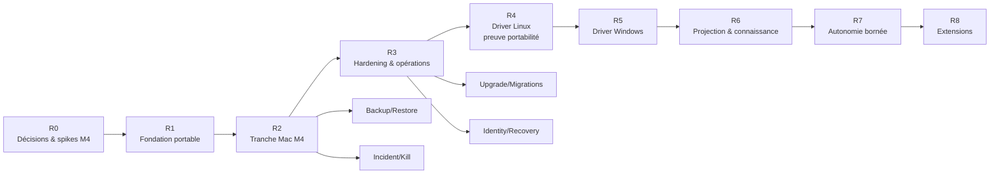

# HelixOS — Roadmap & Specs v5.0.0

> Construire d'abord une tranche Mac mini M4 réellement sûre et récupérable,
> prouver ensuite le contrat sur Linux et Windows, puis seulement ajouter
> connaissance et autonomie.

**Date** : 2026-07-10
**Architecture** : v2.0.0
**Constitution** : v2.0.0
**Principe de livraison** : une fonctionnalité n'est « supportée » que si son
harness, son restore et son mode de retrait ont produit une preuve.

Cette roadmap remplace les anciennes SPEC-001…006 Windows-first. Leurs numéros
restent des références **dépréciées** dans l'historique/code existant, pas des
alias normatifs. Les IDs sont désormais `SEC-*`, `REQUEST-*`,
`IDENT-*`, `PLAN-*`, `GRANT-*`, `COST-*`,
`PATH-*`, `FILE-*`, `DUR-*`, `HITL-*`,
`OPS-*`, `SUPPLY-*`, `PRIV-*`, `KNOW-*`,
`PORT-*`, `PERF-*` et `AUTO-*`.

---

## 0. État actuel et dette de migration

Le dépôt n'est pas vide :

- frontière WSL2/compose et harness PowerShell ;
- cœur Rust MVP-0, mTLS, plans/approval et MCP shim ;
- driver fichier minimal et tests de restart/replay ;
- scripts d'usage et backup Windows.

Les tests kernel/CLI valident une boucle partielle ; l'intégration Hermes live
n'est pas encore prouvée. Le prototype ne satisfait pas l'architecture v2 :

- plans en vol principalement mémoire et journaux JSONL séparés ;
- sémantique de crash limitée, sans `OUTCOME_UNKNOWN` ni réconciliation ;
- paths natifs et tests Windows dans le driver commun ;
- copie/rename sans protocole complet metadata/fsync/file ID ;
- WSL2 et PowerShell comme seul déploiement ;
- compose legacy avec bind hôte actif `/mnt/vault:/vault:ro`, `.env`
  runtime, digest `PIN_ME` et MCP shim non connecté live ;
- pas de gateway modèle/egress contrôlant secrets et coût ;
- pas de superviseur indépendant ni de supply-chain native multi-OS.

Le compose et les scripts WSL existants sont **legacy/non conformes v2**. Un gate
de migration supprime bind hôte, secrets runtime, placeholder digest et anciens
chemins avant tout claim v2. L'état exact inclut aussi : `ScopeLease<PathBuf>`
non signé, plans HashMap/`consumed.jsonl`, hash custom non Ed25519/JCS,
approval sans WebAuthn final et driver `copy+rename` sans file-ID/fsync/
métadonnées.

La migration doit préserver les tests utiles et éviter un rewrite « big bang » :
le nouveau coordinateur et les contrats sont introduits derrière les interfaces,
puis le MVP-0 existant est adapté.

---

## 1. Carte de livraison



### Definition of Done commune

Un lot est terminé seulement si :

- architecture/threat model et Constitution Check sont à jour ;
- contrats et migrations sont versionnés ;
- tests positifs **et négatifs** passent ;
- fault injection couvre les points de commit concernés ;
- logs/métriques/audit sont redacted et actionnables ;
- backup/restore et rollback/update ont été exercés si le lot ajoute de l'état ;
- runbook, mode dégradé et procédure de retrait existent ;
- l'artefact de preuve est archivé avec OS, hardware, versions et digests.

---

## R0 — Décisions et spikes Mac mini M4

**But** : éliminer les inconnues qui pourraient invalider le socle avant de
refactorer le prototype.

**Effort indicatif** : 2–3 semaines solo full-time.

### R0.1 Threat model et flux

Livrer :

- trust zones et data-flow diagram correspondant à `ARCHITECTURE.md` ;
- inventaire des données/secrets et classification initiale ;
- liste des cibles souveraines non autorisables ;
- scénario « VM entièrement compromise » avec résultat attendu ;
- trust de `helix-edge`/TLS/ntfy, contrat `HumanRequestGrant` et
  chat/WebSocket comme canal d'egress authentifié ;
- décision mono-utilisateur initiale et plan administratif souverain ;
- règle « payload agent = classification la plus restrictive » ;
- `disclosure_domain_id` : tout octet VM-local est divulgué au domaine,
  et aucun bail ne révoque une connaissance déjà acquise ;
- décisions sur ce qui reste hors scope.

**Gate** : chaque flux agent→hôte/cloud a un médiateur et un owner ; aucun
host-share n'est nécessaire à une fonctionnalité MVP.

### R0.2 Runtime macOS/arm64

Comparer sur le M4 :

1. VM dédiée Virtualization.framework ;
2. Podman Machine rootless, avec `$HOME:$HOME` et tout montage implicite
   explicitement supprimés ;
3. Apple `container` sur macOS 26+, comme backend expérimental ;
4. Docker Desktop/OrbStack uniquement comme profils de développement.

Mesurer : boot, idle RAM, I/O volume VM-local, canal vsock, crash/restart,
montages réels, egress host-enforced, import d'images `linux/arm64` sans
egress guest et mise à jour.
Consigner aussi si le backend peut créer un second compartiment/VM connaissance
sans partage de disque ni réseau direct avec la VM agent ; l'absence de cette
capacité limite le futur profil knowledge au Tier 2.

**Décision** : choisir un backend de référence et un fallback ; conserver un
`RuntimeAdapter` étroit. Ne pas lier les contrats métier à Compose.

Livrer aussi la responsabilité `helix-vmhost` : entitlement, guest image/
kernel/init, boot/readiness/crash-loop/shutdown, import OCI, vsock et rollback.

**Gate** :

- workload compromis → aucun socket runtime guest ;
- root VM, runtime guest compris → aucun répertoire/socket/API runtime **hôte**,
  NIC généraliste, DNS, NAT, LAN ou Internet ;
- une règle relâchée fait virer le harness au rouge.

### R0.3 Services, TCC et Keychain

Prototypes :

- `LaunchAgent` user pour le core normal ;
- `LaunchDaemon` minimal pour supervisor/fencing ;
- choix d'une racine via companion AppKit et security-scoped bookmark ;
- alternative dédiée service account + ACL si App Sandbox/helper est impraticable ;
- Keychain user et System/file-based Keychain selon contexte ;
- signature ad hoc de dev puis chaîne Developer ID/notarisation de release.

**Gate** : aucune demande Full Disk Access pour le MVP ; les opérations user attendent
proprement un login si leur store/racine n'est pas disponible.

### R0.4 Disponibilité et accès distant

Valider sur la machine réelle :

- deux hostnames stables `chat.*` et `approve.*` ;
- domaine possédé + split DNS/ACME, ou deux identités tailnet ; aucun alias
  MagicDNS supposé certifiable ;
- cookies, CORS, RP ID WebAuthn et renouvellement automatique des certificats ;
- variante Tailscale explicitement choisie avant/après login, sleep/wake et reboot ;
- FileVault SSH/LAN préboot testé séparément du tailnet, Remote Login/recovery,
  wake for network access ;
- restart après retour du courant, UPS et fallback local ;
- valeur réelle d'un relais Linux optionnel.

**Gate** : le runbook ne promet pas de disponibilité pré-login non démontrée.

### R0.5 Performance et dépendances

Créer le baseline M4 :

- RAM installée, version macOS, runtime/VM, allocation CPU/RAM ;
- latence core factice, SQLite, transfert projection, indexation test ;
- inference/transcription candidates natives et CPU ;
- comportement sous pression de mémoire unifiée.
- support manifest initial : macOS exact, Linux KVM/systemd/cgroup v2 exact,
  Windows 11 Pro/Enterprise Hyper-V exact ; runners réels provisionnés ou profil
  explicitement non activé.

Auditer Hermes, hermes-webui et Graphify : version/digest, licence, architecture
arm64, schémas, outils activables, stratégie de pinning et retrait.

**Gate** : SLOs provisoires ratifiés ou amendés avec mesures ; aucune dépendance
`amd64` cachée.

### Artefacts R0

```text
docs/adr/0001-macos-runtime.md
docs/adr/0002-service-and-keychain-contexts.md
docs/adr/0003-network-and-egress.md
docs/adr/0004-approval-origin-and-rpid.md
docs/adr/0005-canonical-signed-contracts.md
docs/evidence/m4-baseline/
```

---

## R1 — Fondation portable et coordinateur durable

**But** : faire du cœur une machine d'état portable testable sans OS réel.

**Effort indicatif** : 4–6 semaines.

### Périmètre IN

#### Contrats

Implémenter dans un crate/package indépendant :

- `HumanRequestGrant`, `TaskLease` et `PolicySnapshot` ;
- `IntentRequest` ;
- `PlanEnvelope` RFC 8785 + SHA-256 + signature Ed25519 ;
- `ApprovalDecision` ;
- `ExecutionGrant / ExecutionReceipt` ;
- `BudgetReservation`, `SupervisorEpoch` et
  `ReconciliationDecision` ;
- `CapabilityReport` ;
- `AuditEvent` et `IndexManifest`.

Contraintes :

- pas de floats, paths OS ou types non déterministes ;
- fixtures golden cross-language ;
- compatibilité N/N-1 explicite ;
- unknown schema/intent = deny.

#### Identité et policy

- root CA offline + issuer/intermediate online limité ; WorkloadIdentity courte et
  key ID/algorithm versionnés ;
- issuer de leases dans le cœur, jamais dans Hermes ;
- délégation monotoniquement restrictive ;
- policy snapshot versionné et default-deny ;
- cibles souveraines codées en deny non surchargeable ;
- quotas et budget réservables.

#### Coordinateur

- SQLite WAL, single writer logique, migrations et online backup ;
- filesystem local, `synchronous=FULL`, checkpoints contrôlés et spike
  macOS fullfsync ;
- machine d'état complète avec `DISPATCHING/SETTLING/AUDIT_PENDING` ;
- transactional outbox ;
- inbox/consumed-grant et receipt durable côté adaptateur ;
- operation ID/idempotency + epoch dans store supervisor indépendant ;
- reconciliation interface et `OUTCOME_UNKNOWN` ;
- UTC signée + deadline monotone liée à `boot_id` ; reboot expire les leases ;
- état restored → nouvel instance/epoch, PAUSED et triggers quarantined.

#### Gates automatisables

- créer `conformance/catalog.yaml` : schéma ID, owner, phase active,
  fixture, hardware, cadence, seuil et evidence URI ;
- créer le Constitution Check qui bloque host-share, egress guest, secret runtime,
  unknown intent, cible souveraine et artefact non vérifié ;
- créer `docs/deviations/` avec schéma owner/expiry/compensation ;
- backup/restore de la DB R1 sur répertoire vierge avant la DoD.

#### Adaptateur simulé

Un `FakeHostAdapter` déterministe permet :

- success, fail, timeout et résultat ambigu ;
- capability changes ;
- compensation/conflict ;
- crash entre toutes les transitions.

### Périmètre OUT

- filesystem Mac réel ;
- WebAuthn/PWA finale ;
- Graphify, cron et UI automation ;
- VSS/APFS/Btrfs snapshots.

### Tests/gates

- `PLAN-001` canonicalisation/property/fuzz ;
- `REQUEST-001` human grant forgé/rejoué ;
- `SEC-002` auth/epoch/schema et `SEC-003` lease replay/expiry/
  widening/cross-task ;
- `GRANT-001` one-shot durable adapter ;
- `DUR-001` crash à chaque transition ;
- deux instances concurrentes → une seule fencing leader ;
- migration DB N→N+1 et rollback autorisé/refusé correctement ;
- initial clean restore R1 ;
- aucune branche `cfg(target_os)` dans les contrats/policy/coordinator.

**Sortie** : un plan factice passe de la requête au receipt, survit aux crashs et
n'est jamais rejoué quand le résultat est ambigu.

---

## R2 — Tranche verticale utile sur Mac mini M4

**But** : chercher, lire et patcher une note Markdown du vault depuis Hermes, avec
frontière, approval, preuve et récupération.

**Effort indicatif** : 4–6 semaines, plus le soak.

### Périmètre IN

#### Runtime

- VM Linux `arm64` choisie en R0, aucun host share ni NIC généraliste ;
- `helix-vmhost`, vsock, import OCI host-side et filtre hôte/hyperviseur ;
- Hermes minimal et MCP shim seulement ; outils shell/file hôte désactivés ;
- image/dépendances par digest et user non-root ;
- aucun Graphify ;
- egress guest bloqué. Soit inférence locale seulement, soit gateway minimale déjà
  conforme : credential Keychain, un provider/modèle/hostname épinglé, connexion
  host-side, aucun redirect, classe public/interne seulement, limites bytes/tokens
  et réservation de coût ; jamais un proxy générique ;
- negative-control harness depuis conteneur **et root VM**.

Les skills créées par Hermes restent dans son volume non fiable. Elles ne peuvent
jamais devenir un package `process.package.run` sans revue/signature humaine.

#### Core/driver macOS

- binaire `aarch64-apple-darwin` ;
- LaunchAgent user, supervisor LaunchDaemon minimal ;
- racine vault enregistrée et identifiée par `root_id` ;
- `host.file.search/read/patch` ;
- résolution handle-relative, no-follow, file ID/volume ID, normalisation/collisions ;
- Spotlight seulement comme accélérateur, fallback scan borné ;
- protocole temp same-dir + pre-image + flush + replace + verify ;
- métadonnées, xattrs et ACL couvertes selon capability report.

#### Approval

- `helix-edge` authentifie le principal chat, signe le
  `HumanRequestGrant` et borne réponses WebSocket/downloads ;
- `approve.*` hostname dédié, page statique sans framework/tiers ;
- RP ID = hostname exact et stratégie cert/noms validée ;
- L1 authentifié et CSRF-safe ;
- L2 WebAuthn lié au plan digest ;
- carte : quoi, où, pourquoi/provenance, anomalie, préconditions, coût,
  atomicité/récupération observées et vérification ;
- ntfy optionnel avec lien opaque non-bearer.

#### Reprise

- receipt durable ;
- crash injection dans le patch ;
- rollback refuse d'écraser une modification humaine ;
- PAUSE/ABORT/HALT indépendants et arbre de processus testé ;
- backup minimal de la DB/CA/config/vault et restore local.

### Périmètre OUT

- autonomie, Graphify, OCR/vision, UI automation ;
- shell/package runner ;
- snapshot APFS ;
- disponibilité pré-login garantie.

### Gates

- `SEC-001` frontière workload/root guest ; `SEC-002` auth/epoch ;
  `SEC-003` lease ; `SEC-004` no-NIC/chat/minimal gateway ;
  `SEC-005` managed secrets ; `SEC-006` agent malveillant ;
- `REQUEST-001` et `GRANT-001` ;
- `PLAN-002` capability/path/policy TOCTOU ;
- `PATH-001` sur APFS case-insensitive et image case-sensitive ;
- `FILE-001` et `FILE-002` ;
- `HITL-001` webui malveillante/cookies/CSRF/replay ;
- `OPS-001` PAUSE/ABORT/HALT ;
- `PORT-002` arm64 natif sans Rosetta ;
- SLO core/UI de `PERF-001` mesurés avant tout claim Tier 1 ;
- soak de dix jours comprenant ≥100 patches/reads, ≥3 restarts forcés,
  ≥3 conflits humains et zéro incident de sévérité 1–2.

**Sortie utilisateur** : « trouve la note X et applique ce patch » fonctionne depuis
le téléphone ou le Mac ; la webui peut être compromise sans gagner l'autorité.

---

## R3 — Hardening, egress et opérations Tier 1 Mac

**But** : rendre la tranche exploitable pendant un an, pas seulement démontrable.

**Effort indicatif** : 6–10 semaines.

### R3.1 Gateway modèle/egress

- provider adapters typés ; aucun proxy URL générique ;
- `helix-egress` séparé, sans fichiers/capacité hôte ; worker compute
  non fiable sans Keychain/réseau/model-pull ;
- credentials Keychain et verbes `secret.use` ;
- DNS contrôlé, destination allowlist, redirect/IP privée refusés ;
- limites bytes/requests/tokens/output ;
- classification/DLP et provenance sticky ;
- payload agent classé restrictif ; cloud moins restrictif seulement par
  handles/manifests fiables ou policy humaine ;
- coût maximal réservé avant dispatch, micro-unités, price table versionnée,
  reconciliation réelle ;
- timeout, retry idempotent, circuit breaker ; fallback de classification,
  juridiction et rétention au moins aussi strictes avec nouvelle réservation ;
- mode local natif M4 derrière la même interface.

**Gate** : `SEC-004` et `SEC-005`, y compris chat/DNS/redirect/
model/ntfy ; `COST-001` réservation/prix/fallback.

### R3.2 Superviseur et packages de processus

- control lane séparée ;
- epoch persistant ;
- process group/session best-effort et descendant escape tests ; package hostile
  dans VM éphémère ;
- `process.package.run` seulement pour packages signés à paramètres typés ;
- sorties bornées, cwd et environnement minimaux, réseau deny par défaut ;
- break-glass humain local séparé.

**Gate** : `OPS-001` exige zéro descendant sous 5 s pour Tier 1 ; tout
survivant échoue le gate **et** ouvre un incident. Reboot après HALT reste PAUSED.

### R3.3 Audit et observabilité

- ledger hash-chainé, sealed segments et checkpoints signés hors hôte ;
- OTLP/Unified Logging redacted ;
- dashboards minimaux : queues, unknown, approvals, coûts, disk/memory, certs,
  backups, descendants ;
- liveness/readiness/dependencies séparés ;
- aucune chaîne de pensée ou secret dans une destination de logs.

**Gate** : `DUR-002` disk full/audit indisponible avant et après effet ;
`DUR-003` tamper/truncation.

### R3.4 Packaging et updates

- app/pkg signé, notarisé, Hardened Runtime ;
- slots A/B core/supervisor/adapter ;
- SBOM, provenance et vérification ;
- backend VM, guest kernel/init/rootfs, runtime, images importées et worker compute ;
- drain, backup, migration expand/contract, smoke, commit/rollback ;
- matrice Hermes/webui/core/shim ;
- renouvellement cert automatique et alerte avant expiration.

**Gate** : `OPS-003` update ratée et migration incompatible ;
`SUPPLY-001` artefacts/signatures/SBOM/provenance/arch.

### R3.5 Backup/restore et disponibilité

- stratégie 3-2-1 chiffrée ;
- SQLite online backup + integrity check ;
- un clean restore initial pour release, puis preuve renouvelée au moins
  trimestriellement ;
- state restored PAUSED, nouvel instance/epoch, leases/plans expirés,
  triggers/cursors quarantined et reconciliation hors-host ledger/provider ;
- ré-enrôlement réseau plutôt que clone d'identité ;
- runbook Mac bureau/appliance/relais ;
- reboot, sleep, FileVault, session verrouillée, provider/tailnet down.

**Gate** : `OPS-002` et `OPS-004` avec RPO ≤ 24 h et RTO ≤ 2 h,
ou amendement chiffré ; `IDENT-001` cert/passkey rotation/recovery et
`HITL-002` perte/revocation ; `PERF-001`/`PERF-002` sur
M4 avant claim Tier 1.

**Sortie** : profil Mac Tier 1 possible si toutes les preuves sont vertes.

---

## R4 — Driver Linux, seconde preuve de portabilité

**But** : casser tôt les abstractions accidentellement macOS.

**Effort indicatif** : 4–8 semaines.

### Périmètre

- cible initiale figée (distro, glibc, kernel, systemd, cgroup v2) sur x86_64
  réel ; arm64 build/smoke jusqu'au runner matériel ;
- profil KVM Tier 1 sans NIC ; rootless Podman nu Tier 2 ;
- systemd user/system selon la propriété des données ;
- UDS + peer credentials ;
- `openat2`/relative handles, case-sensitive paths ;
- inotify/fanotify hints + full reconciliation ;
- cgroup v2/systemd transient scopes ;
- Secret Service ou systemd-creds/TPM, fallback chiffré documenté ;
- packaging signé pour une famille Debian et une famille RPM ;
- AppArmor/SELinux assets quand disponibles.

### Règle de conformance

Le code du test ne branche pas sur « Linux ». Les différences sont des fixtures de
`CapabilityReport` et des attentes déclarées (support/refus), pas des skips
silencieux.

### Gates

- même `SEC/PLAN/PATH/FILE/DUR/HITL/OPS` que Mac ;
- ext4 + un filesystem reflink/snapshot si testé ;
- cgroup kill descendant ;
- backup/restore et A/B update Linux ;
- un corpus de vault copié Mac↔Linux sans collision.
- `PORT-001` : même conformance suite inchangée Mac/Linux.

**Sortie** : le projet peut enfin annoncer « contrat portable prouvé sur deux OS ».

---

## R5 — Driver Windows de production

**But** : migrer la valeur du prototype existant sans réintroduire Windows dans le
cœur.

**Effort indicatif** : 5–8 semaines.

### Périmètre

- Windows 11 Pro/Enterprise x64 + SLAT ; Hyper-V VM sans virtual switch comme
  profil Tier 1, Hyper-V Socket vers un guest avec vsock configuré ; Windows
  Home/WSL2 dédié-durci = Tier 2 ;
- aucun `/mnt/c`, interop, Windows PATH, `\\wsl$` utilisé par le runtime ;
- Windows Service sous identité dédiée pour policy/audit/supervision/VM et secrets
  machine ; helper user pour racines, DPAPI CurrentUser, recherche et futures UIA ;
- named pipe SDDL + validation caller token ;
- file handles/volume IDs, reparse/junction/symlink, ADS, UNC, long paths,
  reserved names, trailing spaces/dots ;
- `ReplaceFileW` et métadonnées/ACL testées ;
- Windows Search/USN remplaçable et post-filtré ;
- Job Objects créés avant reprise, kill-on-close et sans breakaway ;
- DPAPI/CNG/TPM ;
- MSI Authenticode et Event Log/ETW ;
- adaptation des scripts/harness PowerShell existants.

### Périmètre OUT

- VSS/COM sidecar ;
- UI Automation ;
- Windows ARM64 Tier 1.

### Gates

- suite commune sur NTFS, case-sensitive directory et locks ;
- firewall WSL/Hyper-V vérifié sans casser silencieusement les autres distros ;
- crash/rollback sous fichier verrouillé ;
- Job Object descendant escape ;
- restore/update Windows.

**Sortie** : Tier 1 Windows x64 quand les preuves existent ; WSL2 reste clairement
étiqueté niveau d'isolation inférieur.

---

## R6 — Projection, connaissance et calcul natif

**But** : ajouter retrieval et médias sans créer une porte de lecture hôte.

**Effort indicatif** : 3–5 semaines.

### R6.1 Projection CAS

- watcher OS comme hint + scanner périodique ;
- allowlist de racines, classification, secret filters, file/total size limits ;
- projection = déclassification explicite ; seul `agent-readable` entre dans
  un compartiment partagé ;
- CAS de contenu et manifests signés par génération ;
- transfert unidirectionnel vers un compartiment connaissance sans lien direct
  avec Hermes ;
- sharding par domaine de confidentialité ; VM/compartiment séparé ou projection
  éphémère pour les scopes qui ne peuvent pas se divulguer mutuellement ;
- tombstones, garbage collection et reconstruction ;
- chaque query passe par le cœur et est bornée par le `TaskLease` ;
- le cœur relit les contenus autorisés et construit les snippets ;
- provenance/source obligatoire ; résultat marque la tâche non fiable.

### R6.2 Provider de connaissance

Définir un contrat avant d'adopter Graphify :

```text
ingest_generation(manifest_id)
query_candidates(domain_id, query, limits) -> manifest_ids_and_quantized_scores[]
rebuild(generation)
health/schema_version
```

Si Graphify est retenu :

- version et digest épinglés, `linux/arm64` ;
- serving read-only et extractor writable séparés si son architecture l'exige ;
- aucun host mount, provider key ou egress direct ;
- aucun endpoint joignable directement depuis Hermes ;
- aucune sortie texte libre vers l'agent : IDs de manifest et scores bornés
  uniquement, filtrés par le cœur ;
- limites CPU/RAM/PID/I/O ;
- schéma MCP versionné et adapter remplaçable.

### R6.3 Médias et M4

- extraction déterministe code/markdown/PDF text/metadata ;
- OCR local optionnel et borné ;
- transcription backend benchmarké, CPU fallback ;
- vision/enrichissement via gateway modèle ;
- worker local natif Metal/MPS/MLX/Ollama non fiable, sans Keychain, réseau,
  model-pull/admin ni filesystem général ;
- cache par content hash et coût réservé.

### Gates

- `KNOW-001` : secret/excluded absent de projection, index, embeddings,
  cache et backup dérivé ;
- `KNOW-002` : delete/tombstone/rebuild ;
- `KNOW-003` : fraîcheur, overflow watcher et scan de reconciliation ;
- query inter-task/hors lease refusée ;
- tentative du provider de renvoyer ID inconnu/hors domaine/snippet libre refusée ;
- compromission de la VM agent incapable de lire le disque du compartiment
  connaissance Tier 1 ;
- `PERF-001` et `PERF-002` p95/p99, mémoire unifiée, overload ;
- retrait complet de Graphify puis reconstruction depuis manifests.
- backup/restore R6 puis reconstruction des dérivés sans réintroduire un tombstone.

**Sortie** : « où avons-nous parlé de X ? » avec sources et scopes, sans accès hôte
direct du moteur.

---

## R7 — Autonomie bornée

**But** : exécuter sans client connecté, après preuve que pause, restore et budgets
fonctionnent.

**Effort indicatif** : 4–6 semaines.

### Périmètre

- trigger registry souverain : cron, watcher et webhook enregistrés par humain ;
- chaque trigger crée un nouveau `TaskLease` minimal ;
- durable queue/checkpoints avec déduplication et dead-letter ;
- quotas actions/fichiers/octets/concurrence/durée ;
- budgets modèle en devise/micro-unités par trigger/jour/mois + global ;
- réservation pessimiste avant dispatch, reconciliation et safety margin ;
- anti-loop par cause/event/content hash et limite de répétition ;
- policy empêchant tout contenu déclencheur/lu d'élargir le bail ;
- quiet hours, maintenance windows et priorité interactive ;
- notification de résultat et digest ;
- PAUSE automatique sur budget, anomaly ou health critique ;
- opérations externes sans idempotency key classées ambiguës après crash.

### Périmètre OUT

- swarm libre ;
- auto-install de skills/plugins ;
- email/action financière non bornés ;
- UI automation.

### Tests/gates

- `AUTO-001` : trigger falsifié/rejoué, queue dedup/dead-letter,
  contenu injecté, anti-loop et cross-task lease ;
- `COST-001` : provider price change/fallback pendant réservation ;
- boucle coûteuse arrêtée avant plafond ;
- queue pleine et poison job ;
- téléphone/tailnet éteint sans corruption ;
- reboot pendant tâche externe → reconcile, pas double envoi ;
- PAUSE/ABORT/HALT sur workload réel ;
- restore d'un système autonome démarre PAUSED.

**Sortie** : un dossier/projecteur peut être surveillé et résumé avec coût maximal,
source, état et kill prouvés.

---

## R8 — Extensions isolées

Chaque extension est une release séparée avec threat-model delta, capability probe,
tests et retrait :

- helper C#/.NET VSS/COM Windows ;
- snapshots APFS/Btrfs/ZFS comme optimisation de lot ;
- UI Automation (TCC/AT-SPI/UIA) dans helper de session ;
- vision locale lourde ;
- pipeline vocal temps réel ;
- packages d'actions externes (email, calendrier, git hosting) ;
- swarm/multi-agent persistant ;
- nœud Linux distant ou relay haute disponibilité ;
- client natif mobile.

Une extension ne peut jamais faire dépendre le socle portable de sa primitive OS.

---

## Spécifications des runbooks

Les sections suivantes sont des **exigences**, pas encore des procédures
exécutables. Chaque fichier final dans `ops/runbooks/` porte owner,
prérequis, commandes/actions, validations, rollback, escalation, date et preuve du
dernier drill.

| Runbook | Spec owner | Première procédure exécutable |
|---|---|---|
| Mac appliance | R0 | R2 |
| Backup/restore | R1 | R2, complet R3 |
| Upgrade/migration | R1 | R3 |
| Incident/kill/reconciliation | R1 | R2 |
| Identity recovery | R1 | R3 |
| Degradation | R1 | R2 |
| Data lifecycle | R0 | R3 |

### RUNBOOK-MAC-APPLIANCE

Doit couvrir :

- installation signée/notarisée et consentements ;
- LaunchAgent vs LaunchDaemon, login requis et état `WAITING_FOR_USER_SESSION` ;
- Keychain user/System et récupération ;
- `helix-vmhost`, VM start/readiness sans NIC/share, vsock, import OCI,
  images arm64 et rollback guest ;
- hostnames possédés ou identités tailnet distinctes, RP ID/cert renewal ;
- sleep/wake, wake network, FileVault, Remote Login, power restore, UPS ;
- variante Tailscale avant/après login et ré-enrôlement ; FileVault SSH/LAN
  préboot n'est pas supposé passer par le tailnet ;
- relais optionnel, ce qu'il peut et ne peut pas réparer ;
- vérification end-to-end chat + approval + patch après reboot ;
- procédure locale si la récupération distante échoue.

### RUNBOOK-BACKUP-RESTORE

Doit couvrir :

- inventaire de toutes les sources de vérité ;
- 3-2-1, chiffrement, rotation, purge et key custody ;
- SQLite online backup + integrity check, jamais copie brute d'un WAL actif ;
- cohérence CAS/manifests/audit/checkpoints ;
- vault + état Hermes non reproductible ;
- aucune clé brute dans les logs/archives non chiffrées ;
- restore vierge trimestriel, RPO/RTO ;
- PAUSED + epoch bump + invalidation leases/plans/approvals ;
- reconciliation des opérations ambiguës ;
- ré-enrôlement Tailscale/workload certs.

### RUNBOOK-UPGRADE-MIGRATION

Doit couvrir :

- vérification signature/SBOM/provenance/digest ;
- matrice de compatibilité ;
- drain/quiesce et backup ;
- slots A/B natifs, digests OCI ;
- backend VM, guest kernel/init/rootfs, runtime, images importées, protocol
  host↔guest et worker compute ;
- migrations expand/contract et fenêtre de downgrade ;
- smoke fonctionnel + sécurité ;
- rollback core/runtime/schema ;
- révocation d'une release vulnérable ;
- preuve qu'une seule instance a le fencing actif.

### RUNBOOK-INCIDENT-KILL

Doit couvrir :

- signaux de compromission, exfiltration, budget ou audit ;
- PAUSE, ABORT, HALT et fallback local ;
- isolation VM/tailnet, révocation workload/leases/passkeys ;
- descendants et `OUTCOME_UNKNOWN` ;
- préservation du ledger sans secrets ;
- rotation credentials et restore propre ;
- critères de reprise et postmortem.
- procédure détaillée de reconciliation
  `OUTCOME_UNKNOWN/AUDIT_PENDING` avec receipt adapter, provider
  idempotency et décision humaine.

### RUNBOOK-IDENTITY-RECOVERY

Doit couvrir :

- CA root/offline, workload cert rotation, serial denylist et expiry ;
- audit-signing/state-encryption/backup keys séparées ;
- deux passkeys, perte/révocation/recovery ;
- changement de hostname/RP ID interdit ou migration explicite ;
- certificate transparency des noms tailnet ;
- node key rotation et ré-enrôlement ;
- aucune dépendance à une unique clé stockée sur le Mac.

### RUNBOOK-DEGRADATION

Matrice minimum :

| Panne | Comportement |
|---|---|
| policy/lease store down | mutations refusées |
| audit/receipt indisponible avant dispatch | mutation refusée |
| persistance core échoue après effet possible | receipt adapter conservé, `OUTCOME_UNKNOWN/AUDIT_PENDING`, PAUSE |
| provider primaire down | circuit open ; fallback policy ou attente |
| budget/prix inconnu | aucun dispatch payant |
| Keychain verrouillé | `WAITING_FOR_SECRET_STORE` |
| user session absente | tâches user `WAITING_FOR_USER_SESSION` |
| VM down + session user active | core, approval et kill restent observables |
| VM down + aucune session | seul supervisor/status headless ; tâches user attendent |
| approval/ntfy down | opération attend/expire ; aucune auto-approval |
| disk low/full | background pause ; patch refusé avant préparation |
| watcher overflow | scan complet de reconciliation |
| résultat externe ambigu | `RECONCILIATION_REQUIRED` |
| tailnet down | tâches locales continuent selon lease ; aucun ingress |

### RUNBOOK-DATA-LIFECYCLE

Doit couvrir :

- classification, consentement cloud, régions/providers et redaction ;
- inventaire projection/index/cache/embeddings/backups ;
- export utilisateur ;
- suppression/tombstone/GC et preuve sans conserver le contenu supprimé ;
- rétention par flux et legal hold éventuel ;
- test `PRIV-001` et owner des exceptions.

---

## Catalogue d'acceptance

`ARCHITECTURE.md §15` définit le sens des IDs.
`conformance/catalog.yaml`, livré en R1, ajoute owner, activation par
milestone/profil, fixture, cadence, seuil et preuve.

| Cadence | Couverture obligatoire |
|---|---|
| chaque PR | Rust unit/property/fuzz, schémas, migrations, fake adapter, build macOS arm64/Linux/Windows |
| nightly | profils activés seulement : vrai M4/macOS de référence/VM sans NIC ; Linux x64 KVM/cgroup v2/ext4 dès R4 ; Windows 11 Pro/Enterprise Hyper-V/NTFS dès R5 ; WSL job Tier 2 séparé |
| hebdomadaire destructif | crash chaque transition, disk full, watcher overflow, kill descendants, reboot/no-login, restore, upgrade ratée |
| release | VM compromise harness, egress/exfil, approval-origin, passkey recovery, signatures/SBOM, restore vierge, performance |

QEMU et CI hébergée suffisent pour compile/smoke. Ils ne prouvent ni isolation,
filesystem, TCC/Keychain, GPU, boot, sleep ni performance ; ces preuves exigent du
matériel réel.

### Filesystems à exercer

- APFS case-insensitive et image case-sensitive ;
- ext4 et Btrfs/ZFS si la capability est annoncée ;
- NTFS, case-sensitive directory, long paths, junction/symlink/ADS/locks ;
- SMB/NFS, iCloud/OneDrive/placeholders/removable : refus ou Tier 2 explicitement
  prouvé.

---

## Structure cible du dépôt

Transition progressive proposée :

```text
contracts/                 schémas + fixtures golden
kernel/                    helix-core Rust (nom historique conservable)
edge/                      ingress humain + HumanRequestGrant
egress/                    broker réseau/credentials sandboxé
adapters/
  macos/
  linux/
  windows/
supervisor/                kill/fencing indépendant
vmhost/                    lifecycle VM/vsock/import OCI
runtime/                   manifests backend-agnostic + renderers
conformance/               suite commune + fault injection
ops/runbooks/              procédures normatives
docs/adr/                  décisions
docs/evidence/             résultats signés/horodatés
```

Ne pas déplacer mécaniquement tout le code au début. Créer les frontières, migrer
un chemin vertical, puis supprimer l'ancien seulement quand les tests couvrent le
nouveau.

---

## Estimation et gates de produit

Ordres de grandeur solo full-time, après R0 et sans engagement calendaire :

| Objectif | Cumul indicatif | Claim permis |
|---|---:|---|
| tranche Mac utile R2 | 10–15 semaines + soak | prototype Mac sécurisé, pas Tier 1 |
| Mac durci R3 | 18–26 semaines | Tier 1 si toutes preuves passent |
| Linux R4 | +4–8 semaines | portable prouvé sur deux OS |
| Windows R5 | +5–8 semaines | cross-platform Tier 1 selon preuves |
| connaissance R6 | +3–5 semaines | knowledge provider sûr/remplaçable |
| autonomie R7 | +4–6 semaines | autonomie bornée, pas agent omnipotent |

La priorité n'est pas de cocher trois logos OS au plus vite. Elle est de figer un
petit contrat sur M4, le briser volontairement sur Linux, le corriger, puis porter
Windows avant que Graphify et l'autonomie n'augmentent le coût du changement.

---

## Constitution Check de release

Une release est bloquée si l'une de ces réponses est « oui » :

- un workload voit-il un chemin/sock/device hôte ?
- root guest voit-il un share/API runtime hôte, NIC généraliste ou route externe ?
- peut-il sortir sans la gateway ou choisir une URL/DNS/chat client arbitraire ?
- un secret brut apparaît-il dans runtime, prompt, log ou backup non chiffré ?
- un message Hermes nu peut-il remplacer un `HumanRequestGrant` ?
- un agent peut-il émettre/élargir son lease ?
- une intention/version inconnue peut-elle être approuvée ?
- une cible souveraine est-elle atteignable ?
- un effet ambigu peut-il être rejoué automatiquement ?
- une récupération est-elle annoncée sans préparation/vérification ?
- approval et chat partagent-ils hostname/cookie/CORS/service-worker ?
- une projection est-elle partagée entre domaines de divulgation incompatibles ?
- le kill dépend-il du scheduler qu'il doit arrêter ?
- un artefact natif/OCI n'est-il pas signé/épinglé/vérifié ?
- une migration n'a-t-elle pas de backup et règle de rollback ?
- un test requis est-il seulement documenté, skippé ou sans preuve matériel ?

Si toutes les réponses sont « non », la release peut être évaluée contre son Tier ;
elle n'est pas automatiquement Tier 1.
