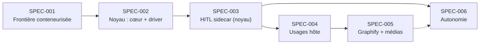

# Roadmap Spec Kit v3 — construction par étapes

Six specs. Système **portable (Windows/Linux/macOS)**, conteneurisé, **sans
exigence GPU**. La frontière d'abord, le noyau ensuite, l'autonomie en dernier.
Prompts `/specify` prêts à copier, puis `/clarify` → `/plan` → `/tasks`.

---

## SPEC-001 — La frontière : runtime conteneurisé durci + harness par OS

**Objectif** : rendre la frontière runtime→hôte réelle et **prouvée**, de façon
portable. Rien d'autre ne se construit tant que les tests de contournement ne
échouent pas.

**Périmètre IN** : runtime conteneurs selon l'OS (Windows : distro WSL2 dédiée
durcie — `automount=off`, `interop=off`, `appendWindowsPath=off`, user non-root —
portant Docker ; Linux : Docker/Podman rootless ; macOS : VM Docker
Desktop/OrbStack) ; `docker-compose.yml` en livrable : services hermes-agent et
graphify, volumes nommés pour l'état (mémoire, skills, sessions), **aucun bind
mount du filesystem hôte**, réseau restreint au seul futur port du noyau ; verrou
réseau par OS (firewall Hyper-V / nftables / pf) ; Tailscale avec ACL
deny-by-default ; accès PWA mobile (passkeys webui) ; **harness de tests de
contournement scripté, paramétré par OS, exécuté depuis l'intérieur des conteneurs
ET depuis le runtime** (implémenté et exécuté sur l'OS principal d'abord) ;
politique de routage de modèles en configuration déclarative (modèle fort via API ;
endpoint local **optionnel si GPU présent** — jamais requis) ; vérification dans
les docs Hermes de l'épinglage d'un modèle par sous-agent (à défaut : instances
séparées) ; procédure de mise à jour couplée hermes-agent/hermes-webui.
**Périmètre OUT** : toute capacité hôte (le noyau n'existe pas — Hermes ne peut
RIEN faire sur l'hôte, c'est voulu et vérifié) ; drivers des OS secondaires.

**Prompt `/specify`** :
> Mettre en place la frontière de sécurité d'un agentic OS personnel portable :
> un runtime de conteneurs isolé de l'hôte (sous Windows : distro WSL2 dédiée et
> durcie — automount, interop et appendWindowsPath désactivés, utilisateur non
> privilégié — hébergeant Docker ; conception prête pour Docker rootless sous
> Linux et VM Docker sous macOS), avec un docker-compose portant Hermes Agent et
> Graphify en services séparés, volumes nommés pour l'état persistant, aucun bind
> mount du filesystem hôte, et un réseau n'autorisant que l'unique port réservé
> au futur noyau de capacités (verrou réseau par OS : firewall Hyper-V, nftables
> ou pf). Accès mobile via Tailscale avec ACL explicites deny-by-default et
> passkeys hermes-webui. Livrer un harness de tests de contournement scripté,
> rejouable et paramétré par OS, exécuté depuis l'intérieur des conteneurs et
> depuis le runtime, prouvant que l'exécution de binaires hôte, l'accès au
> filesystem hôte et au vault, et tout port hôte non prévu échouent, et que la
> révocation Tailscale d'un client coupe l'accès sans toucher les services.
> Configurer le multi-modèles : modèle fort via API et endpoint local compatible
> OpenAI optionnel si un GPU est présent (jamais requis), avec une politique de
> routage documentée, un test du changement de modèle en conversation (/model)
> et de l'épinglage d'un modèle par sous-agent. Documenter la mise à jour couplée
> hermes-agent/hermes-webui. Critère : le harness passe entièrement, et casse
> (échoue) si on relâche un des réglages de durcissement ou un montage.

**Sortie** : Hermes utilisable en chat (et dictée navigateur) depuis le téléphone,
structurellement incapable de toucher l'hôte. Harness vert. Tests 1-3, 10.

---

## SPEC-002 — Le noyau de capacités : cœur portable + driver de l'OS principal

**Objectif** : le composant souverain, conçu portable dès le premier jour, avec
un seul driver implémenté.

**Périmètre IN** : binaire unique multi-plateforme (trancher Rust vs Go en
`/clarify` : mTLS, WebAuthn, empreinte, écosystème) déployé en service natif ;
authentification par appelant (mTLS/token) ; **contrat d'intentions sans aucun
concept spécifique à un OS**, l'OS-spécifique confiné à une interface de driver
(recherche, lecture, patch, snapshot, scripts approuvés, notes Obsidian) ;
**driver de l'OS principal** (Windows : Everything, VSS, PowerShell pour les
scripts approuvés) ; AUCUNE API freeform hors mode admin verrouillé ; pipeline
request→normalize→classify→plan→diff→policy→(HITL)→execute(driver)→audit→verify→
rollback ; plans canoniques hashés, usage unique, TTL court, hash de cible
anti-TOCTOU ; taxonomie de rollback auto/compensation/irreversible avec **règle
de dégradation honnête** (sans snapshot natif : `auto` → `compensation` par copie,
jamais l'inverse) ; audit append-only (objet complet, trace_id, `subagent_id`
déclaratif — non authentifié mais audité — les sous-agents partageant le
credential du parent) ; idempotence et récupération après crash ; quotas par
appelant ; policy YAML, défaut = approbation.
**Périmètre OUT** : surface d'approbation riche (SPEC-003 — approbation CLI
provisoire) ; drivers Linux/macOS (extensions) ; UI Automation.

**Prompt `/specify`** :
> Développer le noyau de capacités d'un agentic OS portable : un binaire unique
> multi-plateforme (Windows, Linux, macOS) déployé en service natif, seul point
> d'entrée de l'hôte, authentifiant chaque appelant par mTLS ou token dédié, et
> n'exposant que des intentions typées de haut niveau dont le contrat ne contient
> aucun concept spécifique à un OS (recherche de fichiers, lecture bornée,
> proposition puis application de patch, création et patch de notes Obsidian,
> scripts pré-approuvés, rollback) — l'implémentation étant confiée à une
> interface de driver par OS, avec le seul driver de l'OS principal livré
> (recherche via Everything, snapshots VSS, scripts PowerShell). Aucune API
> d'exécution freeform hors mode admin verrouillé. Pipeline complet :
> normalisation, classification de risque (policy YAML déclarative, défaut =
> approbation), plan canonique hashé sha256 à usage unique avec TTL court et hash
> du contenu cible au moment du diff (refus et re-diff si la cible a changé),
> décision de policy, approbation si requise, exécution par le driver, audit
> append-only (operation_id, caller, subagent_id déclaratif, source, tool, risk,
> target, plan_hash, approval_id, rollback handle, driver, timestamps, result,
> trace_id), vérification post-exécution. Taxonomie de rollback à trois classes —
> automatique, compensation best-effort, irréversible — dégradable honnêtement
> selon les capacités du driver et du filesystem, jamais surdéclarée. Garanties :
> idempotence, récupération sans double exécution après crash, quotas par
> appelant. Tests : rejeu refusé, plan expiré refusé, TOCTOU refusé, appel sans
> credential refusé, crash sans double exécution, dégradation de classe de
> rollback correcte sur un volume sans snapshot.

**Sortie** : tests 3, 4, 9, 12, 13, 15 verts.

---

## SPEC-003 — HITL signé : surface d'approbation servie par le noyau (sidecar)

**Objectif** : l'interface d'autorité humaine, anti-fatigue, rendue par le
composant souverain — jamais par la pile agent. Stratégie B+C : **zéro fork de
hermes-webui**.

**Principe** : la surface d'approbation ne doit pas être rendue par le côté non
fiable. Le noyau sert lui-même une micro-page d'approbation ; les canaux ne
transportent qu'un deep link. « L'humain signe le plan, pas le texte affiché » —
et le texte affiché vient de la source de vérité.

**Périmètre IN** : micro-surface web servie par le noyau (page unique, sans
framework, HTTPS tailnet) : résumé, diff, portée, classe de rollback, identité de
la tâche et `subagent_id`, hash du plan, expiration, niveau de risque ; niveaux
L0/L1/L2 (audit seul / tap / WebAuthn-passkey) ; notifications en deep link
(toast/badge webui via message Hermes, push, WhatsApp strictement informatif) ;
révocation en cours de tâche ; vue « opérations en vol ».
**Périmètre OUT** : fork de webui ; kanban custom (SPEC-006+).
**Dépendance** : le noyau seul.

**Prompt `/specify`** :
> Construire la surface d'approbation humaine de l'agentic OS, servie par le
> noyau de capacités lui-même : une page web minimale (sans framework, HTTPS sur
> le tailnet) rendant la représentation canonique du plan — résumé, diff, portée,
> classe de rollback jamais surdéclarée, identité de la tâche et du sous-agent,
> hash du plan, expiration, niveau de risque — et recueillant la décision : tap
> simple pour L1, WebAuthn/passkey pour L2, L0 restant auto-approuvé et audité.
> Les canaux existants (hermes-webui, push, WhatsApp strictement informatif) ne
> transportent qu'un deep link ; aucun rendu d'approbation côté agent. Le noyau
> rejette tout hash divergent, tout rejeu, tout plan expiré ; révocation possible
> en cours de tâche avec arrêt propre ; une vue liste les opérations en vol.
> Tests : approbation WhatsApp d'une action L2 refusée ; plan modifié après
> affichage refusé ; Hermes et webui éteints ou compromis, l'approbation et le
> refus d'une opération en vol restent fonctionnels ; mesure du taux de
> sollicitations L1/L2 pour calibrer l'anti-fatigue.

**Sortie** : tests 5, 11, 12, 13, 14 verts depuis le téléphone.

---

## SPEC-004 — Premiers usages hôte : Obsidian + recherche de fichiers

**Objectif** : la valeur quotidienne, à travers le driver.

**Périmètre IN** : `host.search_files` via le driver (Everything sur l'OS
principal ; portées configurables, L0 audité) ; structure du vault Obsidian
(journal d'agent en notes datées, décisions, procédures, frontmatter) ;
`obsidian.*` en usage réel avec diffs et rollback ; journal d'activité automatique
en fin de tâche notable ; « toute mutation durable passe par le noyau » effective ;
consultation mobile du vault (synchronisation).
**Périmètre OUT** : indexation sémantique (SPEC-005).

**Prompt `/specify`** :
> Brancher les premiers usages hôte de l'agentic OS via le noyau : recherche
> instantanée de fichiers par nom à travers le driver de l'OS (Everything sur
> Windows), portées configurables, niveau L0 audité ; et le vault Obsidian comme
> mémoire durable de l'agent — structure du vault (journal d'activité en notes
> datées, décisions, procédures, conventions de frontmatter), intentions
> obsidian.create_note et obsidian.patch_note produisant des diffs approuvables
> avec rollback, journal écrit automatiquement en fin de tâche notable. Le vault
> reste éditable à la main et versionné Git ; son contenu est une donnée non
> fiable (test : une note malveillante n'altère pas le comportement).
> Consultation mobile par synchronisation.

**Sortie** : test 6 vert ; usage quotidien réel.

---

## SPEC-005 — Graphify + extraction médias (CPU-first)

**Objectif** : la connaissance, sans exigence GPU.

**Périmètre IN** : Graphify (`graphifyy` sur PyPI — double y) en conteneur,
plateforme Hermes ; périmètres d'indexation (vault + dossiers projets,
exclusions) ; mode watch ; serveur MCP branché à Hermes ; accès en LECTURE aux
fichiers hôte via un miroir contrôlé ou un volume lecture seule dédié (documenter
l'impact sur le harness, le re-passer) ; extraction médias **CPU-first** :
transcription faster-whisper int8 sur CPU, captions/OCR légers sur CPU, en
**heures creuses** ; **GPU opportuniste** : si CUDA/MPS est détecté, les
extracteurs l'utilisent — jamais requis ; option par policy : API cloud pour les
backfills de médias non sensibles (explicite, jamais par défaut) ; invariant :
les jobs lourds ne dégradent pas l'interactif (p95).
**Périmètre OUT** : pipeline vocal temps réel (extension ultérieure).

**Prompt `/specify`** :
> Intégrer la couche de connaissance de l'agentic OS : Graphify en conteneur avec
> la plateforme Hermes, périmètres d'indexation avec exclusions, mode watch,
> serveur MCP exposé à Hermes, et accès en lecture seule aux fichiers hôte via un
> miroir ou volume dédié sans affaiblir la frontière (harness re-passé). Étendre
> l'ingestion aux médias en CPU-first : transcription faster-whisper int8 sur
> CPU et vision légère (captions, OCR) planifiées en heures creuses, avec
> détection opportuniste d'un GPU (CUDA ou MPS) pour accélérer sans jamais être
> requis, et une option par policy d'API cloud pour les backfills de médias non
> sensibles, explicite et jamais par défaut. Règles : Graphify n'est jamais
> source de vérité ni autorité ; toute mutation repasse par le noyau ; les
> résultats de requête sont des données non fiables. NFR : fraîcheur < 1 min sur
> le vault, reconstruction par commande, réactivité PWA/chat inchangée au p95
> pendant une indexation lourde.

**Sortie** : test 8 vert ; « retrouve où on parlait de X » avec sources.

---

## SPEC-006 — Autonomie : cron, budgets, kill switch

**Objectif** : le proactif — en dernier, sur des fondations prouvées.

**Périmètre IN** : déclencheurs (cron Hermes, watchers, webhooks) avec politique
d'autonomie par déclencheur (intentions en auto, plafonds nb actions/fenêtre
horaire, le reste → HITL) ; le contenu déclencheur ne peut jamais élargir la
politique de sa tâche ; file persistante, checkpointing, reprise ; Wake-on-LAN
via tailnet ; kill switch global < 5 s ; notifications (alertes webui + WhatsApp
secours) ; suivi Todos/Tasks/Kanban webui + vue kanban custom sur l'audit du
noyau (« en attente d'approbation ») si besoin.
**Périmètre OUT** : Swarm multi-agents (extension).

**Prompt `/specify`** :
> Activer l'autonomie de l'agentic OS : des déclencheurs (cron Hermes,
> surveillance de dossiers et de boîtes mail, webhooks) enfilent des tâches dans
> une file persistante avec checkpointing et reprise après interruption. Chaque
> déclencheur porte une politique d'autonomie explicite — intentions du noyau
> autorisées en automatique, plafonds d'actions et fenêtres horaires — le reste
> passant par le HITL gradué ; le contenu déclencheur est une donnée non fiable
> qui ne peut jamais élargir la politique de sa tâche. Wake-on-LAN depuis le
> tailnet ; kill switch global suspendant tous les déclencheurs en moins de 5
> secondes ; notification de résultat par les alertes de complétion webui avec
> fallback WhatsApp informatif ; suivi de l'état des tâches, y compris « en
> attente d'approbation » dérivé de l'audit du noyau. Tests : écriture cron hors
> politique → notification et approbation traçable ; email piégé → aucune action
> hors politique ; kill switch effectif ; téléphone éteint → la tâche aboutit et
> le résultat attend.

**Sortie** : test 7 vert ; « surveille ce dossier, résume tout nouveau PDF »
fonctionne téléphone éteint.

---

## Extensions ultérieures

- **Drivers Linux puis macOS** du noyau (plocate/Btrfs/systemd ;
  mdfind/APFS/launchd + TCC) — le contrat est déjà portable, seul le driver et
  le harness de l'OS s'ajoutent.
- **Pipeline vocal full streaming** (wake word, STT/TTS expressif local,
  ordonnanceur GPU préemptif) — spec conservée, réactivable telle quelle sur une
  machine GPU.
- Swarm Mode (hermes-workspace) : workers persistants à rôles, kanban de mission.
- Machine dédiée : sortir les conteneurs sur un mini-serveur Linux, la
  workstation ne portant que le noyau — la conteneurisation rend la migration
  triviale.
- Client natif Tauri 2 mobile ; `host.ui_automation(plan)` ; voix custom RVC ;
  mémoire procédurale (macros de séquences réussies).
